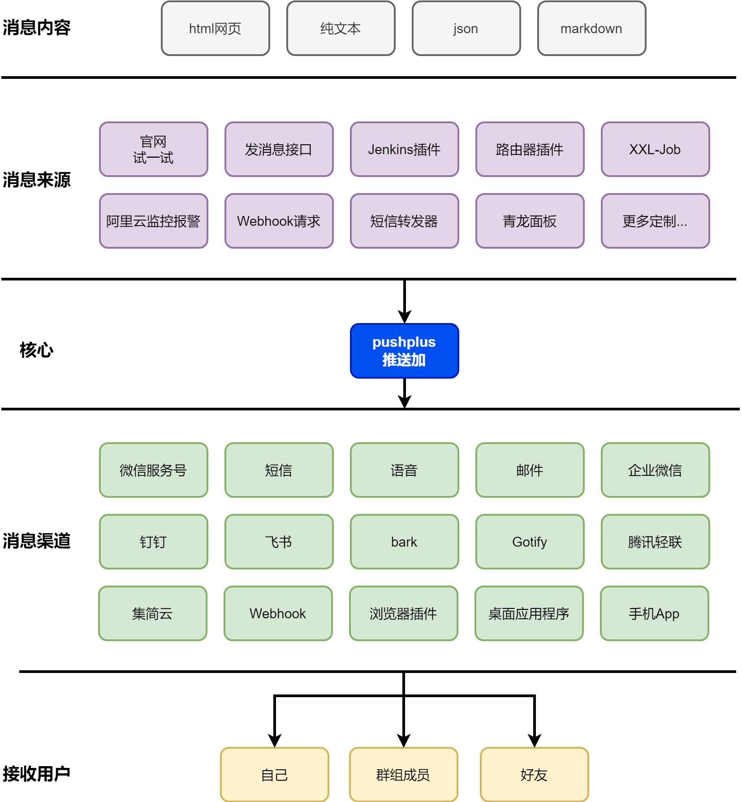

# 介绍

> **官网：[www.pushplus.plus](https://www.pushplus.plus)** \
> **微信服务号：pushplus 推送加** \
> **QQ交流群：28619686 ** \
> **&nbsp;&nbsp;&nbsp;&nbsp;&nbsp;&nbsp;&nbsp;&nbsp;&nbsp;&nbsp;&nbsp;&nbsp;&nbsp;&nbsp;&nbsp;&nbsp;&nbsp;&nbsp;&nbsp; 161672256 ** \
> **联系我们：[联系我们](/introduce/contact.md)** \
> **智能助手：[智能助手](https://helper.pushplus.plus/)**

   
  有问题请使用[智能助手](https://helper.pushplus.plus/)咨询。如只是碰到[收不到消息](/help/message.md)，[账号被封](/help/lockdown.md)，[请求限制](/help/limit.md)等使用问题，请自行查看[常见问题](/help.md)，里面已详细的描述了如何解决！

## 一. 引言
　&emsp;&emsp;pushplus(推送加)是一个集成了微信、短信、语音、邮件、微信ClawBot、QQ、企业微信、钉钉、飞书、bark、Gotify、腾讯轻联、集简云、浏览器插件、桌面应用程序、App等渠道的实时消息推送平台。只需要调用简单的API，即可帮您迅速完成消息的推送，使用简单方便。

## 二. 功能架构图
　&emsp;&emsp;pushplus的功能如下图所示，pushplus本身仅实现最核心的推送功能，将不同类型的消息推送到各种渠道上。其他功能有第三方应用来实现，目前已有大量的第三方程序、脚本、应用与pushplus做了集成。

## 三. 开发的目的
　&emsp;&emsp;pushplus的目的就是大幅简化消息类推送功能的开发。像是微信公众号的主动推送技术上并不复杂，但是需要认证服务号，备案的域名。这就导致了个人用户与模板消息无缘。而很多时候开发者也只需要一个简单的提醒功能，单独去维护一个推送项目，成本太大，所以pushplus就是为了解决这些用户的痛点，为帮助普通用户和开发者而来的。

## 四. 不同点
　&emsp;&emsp;pushplus在实现核心的消息推送功能后，并没有止步不前，而是进一步封装功能，降低使用成本。API接口更多的是针对开发人员的，如果因为提供了接口就把具体实现交给别人的话，那么pushplus只会是默默无闻小众的一个服务。我们希望不会开发的用户也可以方便的时候使用。所以针对数据来源端，我们开发了相关的插件，如Jenkins插件，路由器插件，阿里云监控等，就是希望用户只需要配置下便能使用了，不需要处理复杂的解析展示等逻辑，最大可能的减少开发的介入。同时我们也进一步的扩展推送的渠道，不仅只是微信公众号这一种方式，全方面的覆盖各种使用场景。

## 五. 产品优势
　&emsp;&emsp;相较于其他产品，pushplus始终保持以用户为中心的产品设计思路。有着自身一定的产品优势。

### 1. 支持多种渠道
并不仅限于微信公众号一种渠道，对接了多种渠道，并在不停的增加更多的发消息渠道。并有自己开发的浏览器插件和桌面应用程序可以摆脱第三方渠道的限制。

### 2. 多年稳定运营
从2019年上线至今，已稳定运行多年，并不断的迭代更新。用户可通过QQ群、微信群等多种方式来反馈问题，及时响应处理。

### 3. 文档全面
各功能均有提供详尽的使用文档和操作说明。系统的功能均有提供开放接口方便与第三方系统的集成对接。

## 六. 费用说明
&emsp;&emsp;您可以免费使用我们绝大部分的功能，像短信、语音等有较大成本的推送渠道按量计费。具体可以在[额度说明](https://www.pushplus.plus/use.html)页面查看。另外为了满足发送量较大的用户，推出了会员服务。具体可以查看[会员功能说明](/function/vip.md)

## 文档目录

### 简介
- [服务协议](/introduce/service.md) - 服务协议
- [用户隐私协议](/introduce/privacy.md) - 用户隐私协议
- [联系我们](/introduce/contact.md) - 联系方式

### 使用教程
- [一对一消息](/function/one.md) - 一对一推送功能
- [一对多消息](/function/more.md) - 一对多推送功能
- [好友消息](/function/friend.md) - 好友功能介绍
- [发邮件来推送消息](/function/mail.md) - 邮件推送消息功能
- [积分群组](/function/paidTopic.md) - 积分群组功能
- [文本命令](/function/txt.md) - 文本处理功能
- [图片服务](/function/image.md) - 图片上传与管理
- [会员功能](/function/vip.md) - 会员特权功能
- [收/发消息设置](/function/setting.md) - 系统设置功能
- [系统功能额度](/guide/use.md) - 系统功能使用额度
- [消息接口限制](/help/limit.md) - 使用限制说明
- [实名认证说明](/function/verify.md) - 账号验证功能
- [预处理信息配置](/function/pre.md) - 消息预处理功能

### API文档
- [消息接口文档](/guide/api.md) - API接口使用说明
- [开放接口文档](/guide/openApi.md) - 开放API说明
- [消息回调说明](/guide/callback.md) - 回调接口使用说明
- [返回码说明](/guide/code.md) - 状态码说明
- [SDK说明](/guide/sdk.md) - 官方 SDK 使用说明
- [Demo代码](/guide/demo.md) - 各种语言的代码示例
- [pushplus MCP Server](/guide/mcp.md) - MCP Server 配置
- [pushplus Skill 使用说明](/guide/skill.md) - Skill 使用说明

### 渠道配置
- [发送渠道说明](/channel.md) - 消息发送渠道说明
- [绑定自己的微信公众号](/extend/mp.md) - 微信公众号集成
- [APP渠道使用说明](/channel/app.md) - App 渠道
- [浏览器插件使用教程](/extend/extension.md) - 浏览器插件
- [桌面应用程序使用教程](/extend/desktop.md) - 桌面客户端
- [webhook渠道配置](/extend/webhook.md) - WebHook集成
- [微信ClawBot渠道使用说明](/channel/clawbot.md) - ClawBot 渠道
- [QQ机器人渠道使用说明](/channel/qq.md) - QQ 机器人渠道
- [企业微信应用配置](/extend/cp.md) - 企业微信集成
- [邮件渠道配置](/extend/mail.md) - 邮件集成
- [短信渠道配置](/extend/sms.md) - 短信集成
- [语音渠道配置](/channel/voice.md) - 语音渠道

### 消息模板
- [消息模板说明](/template.md) - 消息模板中心
- [阿里云监控](/extend/cloudMonitor.md) - 云监控集成
- [Jenkins插件](/extend/jenkins.md) - Jenkins集成
- [路由器插件](/extend/route.md) - 路由器插件
- [支付成功通知模板](/extend/pay.md) - 支付通知集成

### 扩展应用
- [xxl-job推送设置](/extend/xxl-job.md) - XXL-Job集成
- [推送到企业微信机器人教程](/extend/cpbot.md) - 企业微信机器人配置
- [推送到钉钉机器人教程](/extend/dingding.md) - 钉钉机器人配置
- [推送到飞书机器人教程](/extend/feishu.md) - 飞书机器人配置
- [通过腾讯轻联实现发送短信](/extend/hiflow.md) - 腾讯轻联集成
- [通过集简云发送企业微信消息](/extend/jijyun.md) - 集简云集成
- [调用IFTTT的webhook](/extend/ifttt.md) - IFTTT集成
- [自定义webhook配置](/extend/diy.md) - 自定义 webhook
- [使用pushplus接收短信内容](/extend/smsforward.md) - 短信转发到微信
- [使用「网页侦探」+「pushplus」来监控黄金价格变化](/extend/webdiff.md) - 监控黄金价格

### 常见问题
- [常见问题](/help.md) - 使用帮助和常见问题
- [APP上没有通知弹框](/help/app.md) - App 通知问题
- [Get请求导致的问题](/help/get.md) - Get请求问题
- [实名认证相关问题](/help/verify.md) - 验证功能说明
- [用户token和消息token有什么区别](/help/token.md) - Token使用说明
- [发送消息接口限制](/help/limit.md) - 使用限制说明
- [微信消息模板是否可以自定义](/help/template.md) - 消息模板说明
- [收不到消息如何排查](/help/message.md) - 消息相关问题
- [才收到几条消息却被限制发送了](/help/count.md) - 使用统计说明
- [IP被禁止访问原因](/help/ip.md) - IP限制说明
- [如何解封账号](/help/lockdown.md) - 账号封禁说明
- [一对多消息为什么只有我自己收到](/help/topic.md) - 主题功能说明
- [提示无用户接收消息](/help/nouser.md) - 无用户问题
- [发送消息有延迟](/help/delay.md) - 消息延迟收到原因
- [如何在公众号中显示推送内容](/help/showmessage.md) - 消息展示问题
- [菜单上的激活消息有什么用](/help/activation.md) - 关于激活消息
- [是否支持发送图片](/help/image.md) - 图片发送说明
- [消息内容中如何换行](/help/line.md) - 消息换行问题
- [用户信息状态不合法](/help/status.md) - 状态码说明
- [接口是否支持https](/help/https.md) - HTTPS相关问题
- [json模板如何正确展示](/help/json.md) - JSON格式说明
- [pushplus官网](/help/homepage.md) - 主页功能说明
- [如何注销账户](/help/logout.md) - 注销账户操作

### push生态
- push表单
  - [开放接口文档](/ecosystem/form.md)
  - [push表单提交后推送](/ecosystem/doc/webhook.md)
- push文档
  - [开放接口文档](/ecosystem/doc.md)
- push表格
  - [开放接口文档](/ecosystem/sheet.md)
- [改页侦探](https://webdiff.perk-net.com/doc/)

### 常用工具
- [常用工具](/tool/index.md) - 在线调试工具
