# APP渠道使用说明

## 引言
　&emsp;&emsp;pushplus已正式发布APP，并在不断迭代优化功能。可在官网资源中心中下载体验，已同步上架到了各家手机厂商App商城。

## 对接情况

| 厂商/渠道 | App商城 | 厂商通知 |
| --- | --- | --- |
| 苹果 | <a href="https://apps.apple.com/cn/app/pushplus/id6755597125" target="_blank">已上架</a> |  已对接 | 
| 荣耀 | <a href="market://details?id=com.perk.pushplus.app" target="_blank">已上架</a> |已对接 |
| 小米 | <a href="mimarket://details?id=com.perk.pushplus.app" target="_blank">已上架</a> | 已对接 |
| OPPO |<a href="market://details?id=com.perk.pushplus.app" target="_blank">已上架</a> |已对接 |
| vivo | <a href="vivomarket://details?id=com.perk.pushplus.app" target="_blank">已上架</a> |已对接 |
| 华为(安卓) | <a href="appmarket://details?id=com.perk.pushplus.app" target="_blank">已上架</a> | 已对接 |
| 原生鸿蒙 | <a href="https://appgallery.huawei.com/app/detail?id=com.perk.pushplus.app.hw" target="_blank">已上架</a> | 已对接 |
| 魅族 | <a href="https://app.meizu.com/apps/public/detail?package_name=com.perk.pushplus.app" target="_blank">已上架</a> |已对接 |
| 谷歌 | <a href="https://play.google.com/store/apps/details?id=com.perk.pushplus.app&pli=1" target="_blank">已上架</a> | 已对接 |
| 应用宝 |<a href="tmast://appdetails?pname=com.perk.pushplus.app" target="_blank">已上架</a> | - |

- 安卓安装包下载地址：<a href="https://www.123865.com/s/3UMBjv-eUYUh" target="_blank">https://www.123865.com/s/3UMBjv-eUYUh</a>

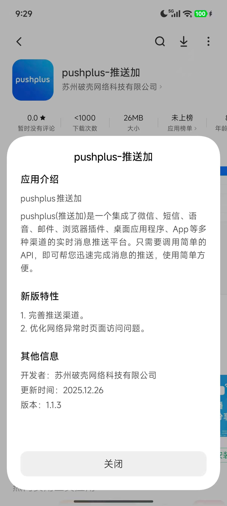

## 功能介绍

### 1. 登录
支持微信登录，用户token、邮箱、手机号登录，Apple登录和华为登录。如需使用密码登录，请先到官网的“个人中心”里设置“登录密码”。

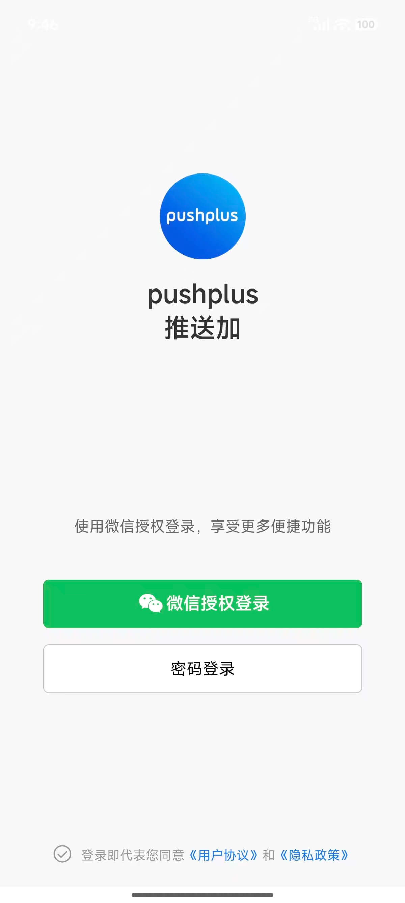

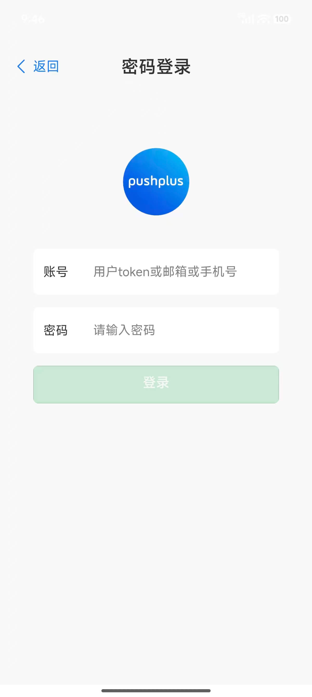


### 2. 消息
分为本机消息和历史消息。App渠道的消息会使用手机的通知来进行提醒，请给pushplus开启手机的通知权限。
- 本机消息：推送给当前账号的App渠道消息。消息永久存储在手机中，即使断网也可以查看消息详情。消息列表中可以直接预览消息内容。
- 历史消息：可以查看30天内推送的所有渠道消息。

特别说明：已与小米、华为、荣耀、OPPO、vivo、魅族、Google这样的主流手机厂商进行了推送对接，无需打开App，也能在后台收到pushplus通知。

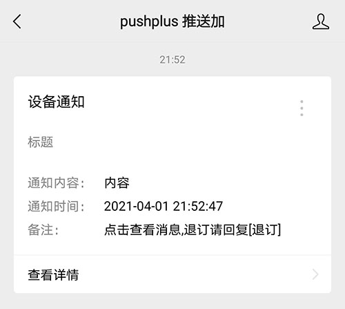

### 3. 联系人
管理自己的好友和群组。
- 新增好友先创建自己的个人二维码，分享给对方扫码添加。
- 群组创建后扫描群组二维码加入群组。

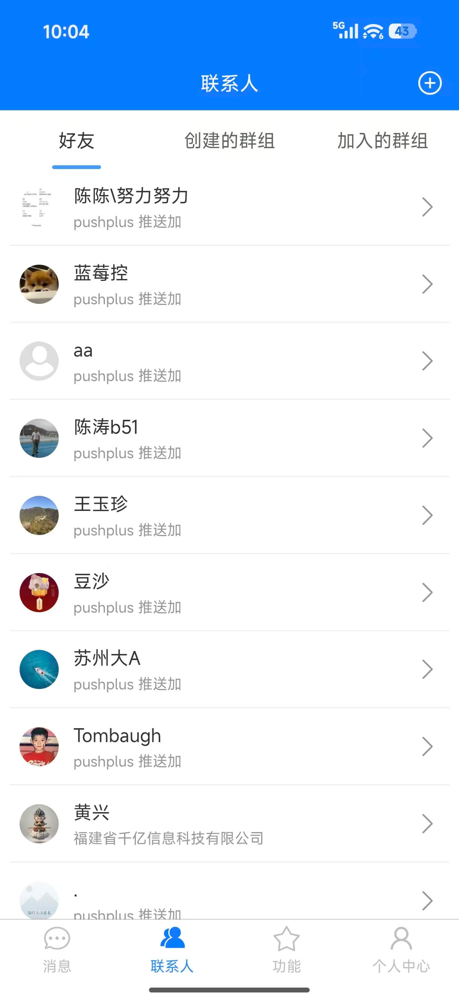

### 4. 功能
- 试一试：可以发送消息，查询发送最终结果，查看最新请求。主要用途是帮助测试推送功能和排查收不到消息的问题原因。
- 扫一扫：可用于登录pushplus账号，加入群组，加好友。
- 群组市场：公开可订阅的群组内容，方便直接获取消息。
- 看一看：集成的短视频内容
- 智能助手：如在使用中有碰到疑问，可以优先咨询智能助手。

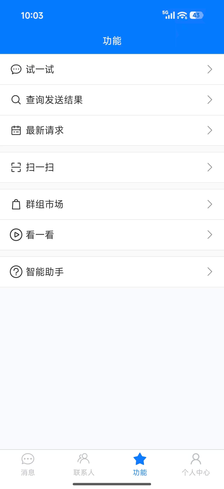

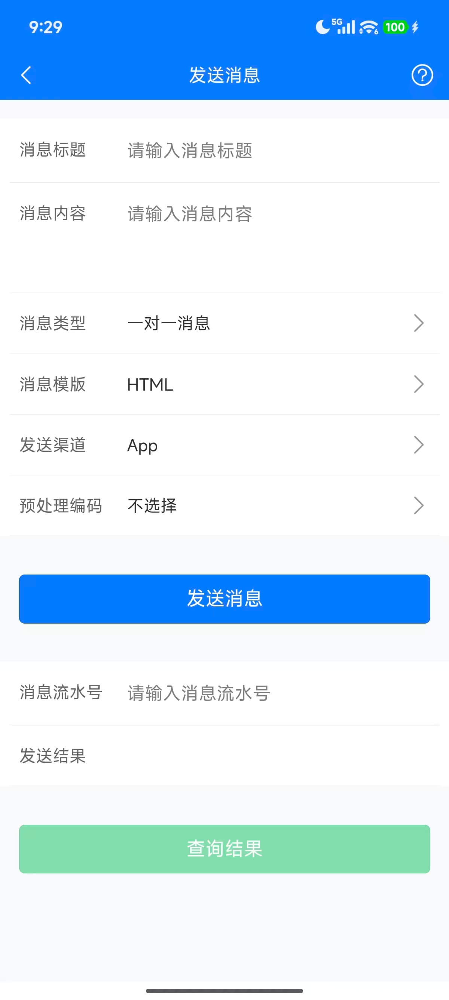

### 5. 个人中心
设置个人信息和各参数配置，可直接进行积分充值、开通会员。

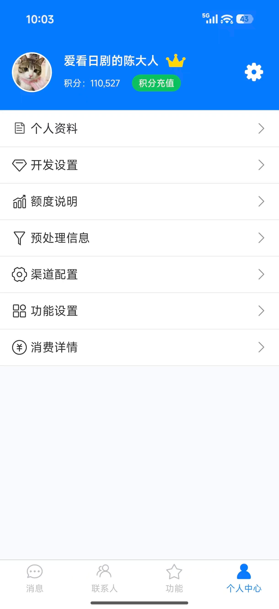

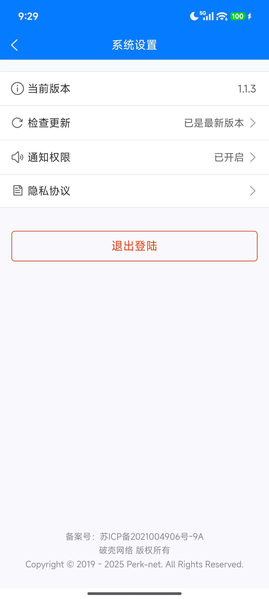

## 其他说明

### 1. 设备相关
一个账户只能登录一台设备App，如果在第二台设备上登录App，会导致上一个设备上已登录的账户主动退出登录。
用户可以在“客户端设备”中主动下线已登录的设备。

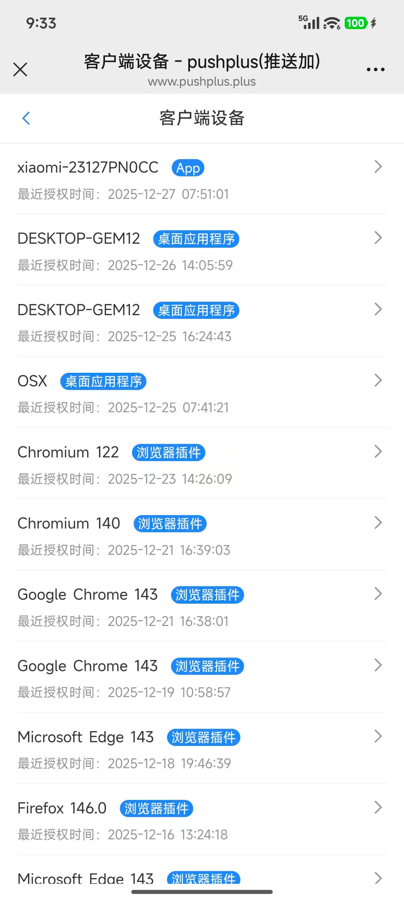

### 2. App发送渠道
发送渠道（Channel）参数上新增了“app”渠道。只有将发送渠道设置为app，才会在pushplus的App上收到通知。其他渠道不会在App上有通知，但是可以在历史消息列表中查看到。

接口请求示例
- 请求地址：http://www.pushplus.plus/send/{token}
- 请求方式：POST
- 请求内容：

```
{
    "token":"{token},
    "title":"消息标题",
    "content":"消息正文内容",
    "channel":"app",
}
```

- 说明：app是一个单独的渠道。不要选了微信渠道发送消息，然后来说App上没有通知！

### 3. 同步接收微信渠道消息
　&emsp;&emsp;在“个人中心” -> “功能设置” -> “微信渠道消息转发” 中可以开启“转发到App渠道”的消息。也就是发送渠道为微信服务号(wechat)的消息也会在App上接收到，无需再请求一次app渠道的消息，并且是不计算App(app)渠道的请求次数的。

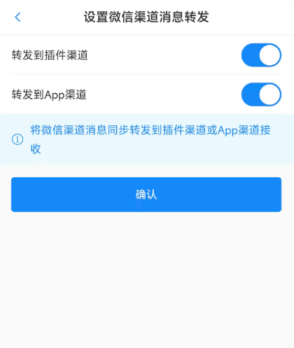
