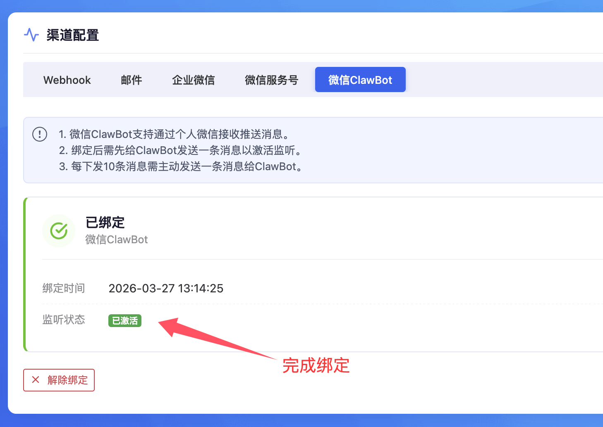

# 微信ClawBot渠道使用说明

## 引言
　&emsp;&emsp;微信官方在新版App插件中增加了微信ClawBot功能，可以用于对接自己搭建的OpenClaw。pushplus基于微信的ClawBot协议，进行了消息推送的对接，实现了主动推送文字消息。

## 微信ClawBot官方限制
微信为了避免过渡的骚扰用户，也对这个渠道做了一些限制。因为微信ClawBot非常的新，后续也可能会有进一步的调整。pushplus也会及时跟进。

1. 初始化需要主动的扫码绑定，且一个微信号只能绑定一个ClawBot。
2. 绑定后需要主动发起一次对话，才能下发消息。
3. 每下发10次消息后，需要主动发起一次对话。
4. 每隔24小时，也需要有一次主动对话。

## 效果展示
 

## 操作流程
1. 个人中心->渠道配置->选择”微信ClawBot“，点击”立即绑定“。

 

2. 使用微信扫描生成的二维码； 

3. 绑定成功后，主动发送一条消息到微信ClawBot上，点击“我已发送”按钮；

 

3. 监听状态显示“已激活”，就可以使用pushplus接口来推送消息了，发送渠道(channel)参数选择“clawbot”。

 

接口请求示例
- 请求地址：http://www.pushplus.plus/send/{token}
- 请求方式：POST
- 请求内容：

```
{
    "token":"{token},
    "title":"消息标题",
    "content":"消息正文内容",
    "channel":"clawbot",
    "template": "txt"
}
```

- 说明：均支持一对一，一对多和好友消息。建议template使用txt。

 

## 其他说明
1. txt消息模板可以展示更多消息内容
消息模板（template）参数，使用txt的话，会直接把发生内容展示出来。其他消息模板因为是富文本，仅展示消息内容中的前50个字，更多内容需要点击“查询详情”查看。

2. 开放接口支持接收发送消息内容
开放接口中针对微信Clawbot提供了相关的接口，可以通过“[获取发送消息](../guide/openApi.html#_5-获取发送消息)”接口来获取用户主动发送给微信ClawBot上的消息内容。从而根据用户输入内容来自行调用推送接口回复。
