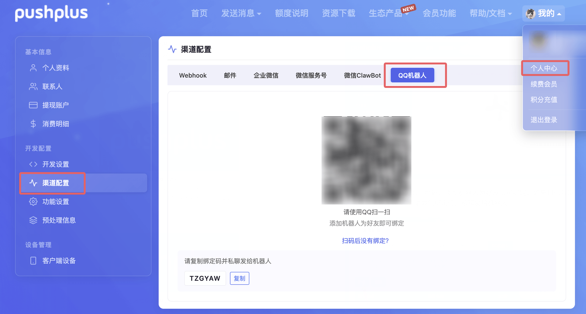
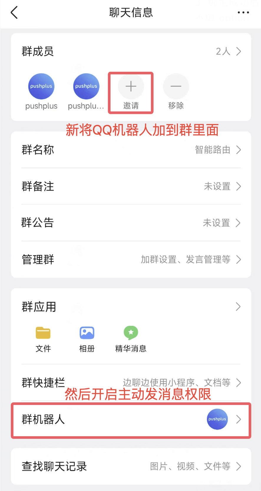
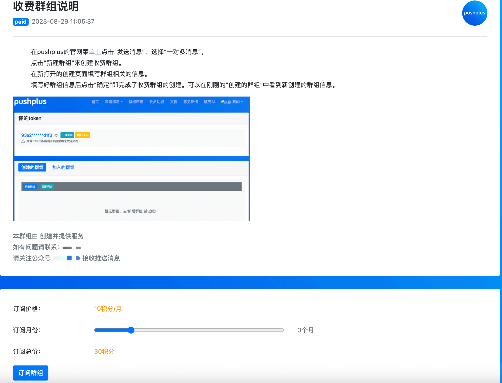

# QQ机器人渠道使用说明

## 引言
　&emsp;&emsp;pushplus对接了QQ官方机器人能力，绑定后可以把消息推送到自己的QQ，也可以推送到机器人已加入的QQ群。发送渠道(channel)参数填写 `qq`。

## 操作流程
1. 个人中心->渠道配置->选择“QQ机器人”。


 
   
2. 使用QQ扫描页面上的二维码，添加机器人为好友即可绑定。如果扫码后没有自动绑定（例如已经是好友），请复制绑定码，私聊发给机器人。


  
3. 绑定成功后即可向自己推送消息，无需额外配置。发送渠道(channel)参数选择 qq，不填 option。




    

4. 如需发送到QQ群：先将机器人拉进目标群，并在群内允许机器人主动消息；然后新增一条群配置，发送时把 option 填成该配置编码。

    
 
## 接口请求示例
- 请求地址：http://www.pushplus.plus/send/{token}
- 请求方式：POST
- 发给自己：

```
{
    "token":"{token}",
    "title":"消息标题",
    "content":"消息正文内容",
    "channel":"qq",
    "template":"txt"
}
```

- 发送到QQ群：

```
{
    "token":"{token}",
    "title":"消息标题",
    "content":"消息正文内容",
    "channel":"qq",
    "option":"qqgroup",
    "template":"markdown"
}
```

- 说明：
1. 均支持一对一、一对多和好友消息。发送到指定QQ群时不支持同时填写 topic 或 to。
2. 建议 template 使用 txt 或 markdown。txt 会完整展示正文；markdown 走 QQ 原生 Markdown。
3. 渠道值使用 `qq`。



## 其他说明
1. 新增群配置时，该群必须允许机器人主动推送，且同一个QQ群只能创建一条配置。
2. QQ机器人渠道日请求次数：实名用户 200 次，会员 1,000 次。
3. 单条消息正文上限约 2000 字。txt 模板会尽量完整展示；其他富文本模板仅摘要展示，详情需点击链接查看。QQ Markdown 不支持代码块和 HTML。
4. 开放接口提供了绑定、解绑、群列表和群配置的管理能力，详见[开放接口文档 - QQ机器人接口](../guide/openApi.html#_9-qq机器人接口)。
