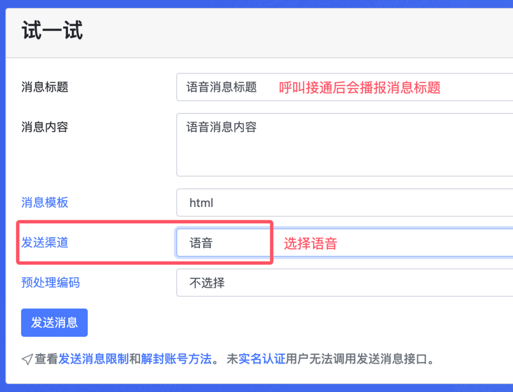
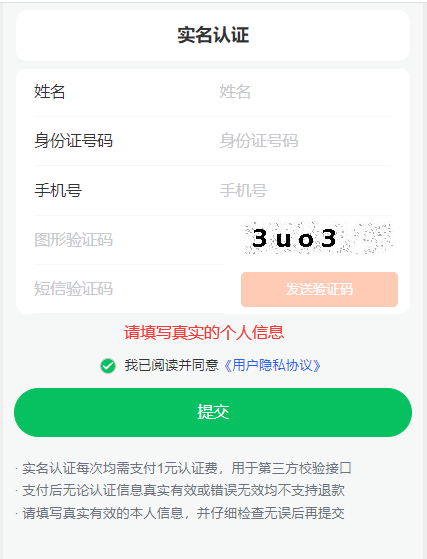
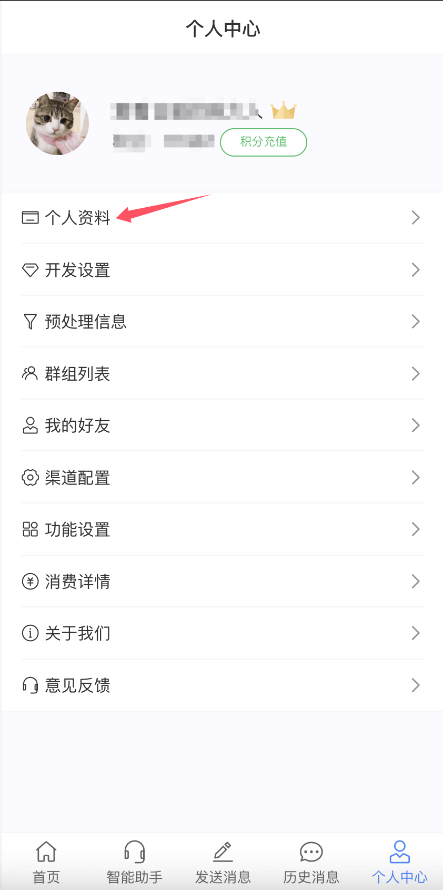
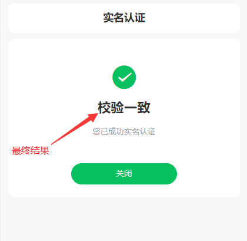
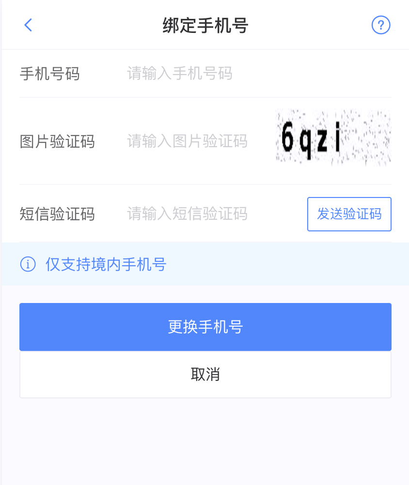
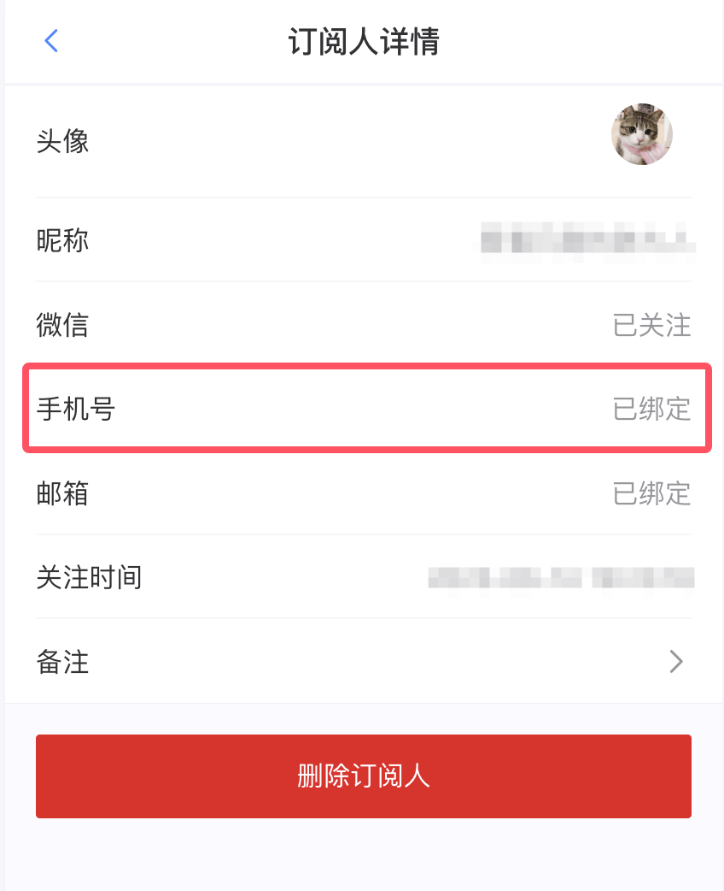

# 语音渠道使用说明

　&emsp;&emsp;pushplus中增加了语音渠道，实现主动拨打电话，接听后自动播放消息标题的功能。

## 一. 注意事项
1. 一对一消息需要先配置好自己的手机号码，否则将无法推送消息。
2. 在一对多的群组中只会推送给已配置手机号码的用户，未配置的用户无法收到。
3. 晚间时段（晚十到次日早八）为防止骚扰，频率有严格限制，无法给同一手机号连续呼叫。
4. 语音接听后只会播放消息标题，不会播放消息内容。
5. 来电号码有概率被手机安全软件定义为广告推销从而拦截，或者运营商进行了拦截。请自行调整手机拦截设置。

## 二. 使用说明
1. 试一试界面测试使用
如果只是简单的测试，可以在官网的“试一试”功能中使用。发送渠道选择“语音”即可。示例如图：



公众号菜单中，小程序，桌面应用程序中都有测试的入口，功能和“试一试”一样。



2. 接口请求示例
- 请求地址：http://www.pushplus.plus/send/{token}
- 请求方式：POST
- 请求内容：

```
{
    "token":"{token},
    "title":"消息标题",
    "content":"消息正文内容",
    "channel":"voice",
}
```

- 说明：主要就是channel中填写voice参数。

## 二. 扣费说明 
1. 语音渠每次呼叫扣减30积分（0.3元），会提前判断账户中积分是否足够抵扣，如果积分不足将会发送失败。
2. 推送一对多消息，因为是多人，群发给不同的手机号码，所以会按群组中用户数量进行扣减。不会只按照一次语音呼叫来扣费。
3. 语音呼叫失败，如未接通，手机号码异常等渠道造成的失败，将会自动退还消费的积分。由于语音呼叫会有延迟，退还时间会有相应的延迟周期。


## 三. 手机号配置教程
想要接收到语音渠道的来电，需要提前配置好自己的手机号码。PC官网、公众号菜单、小程序、桌面客户端上都可以绑定手机，操作大同小异。下面以公众号菜单为入口演示：
点击在“pushplus 推送加”公众号菜单里面的“功能”->“个人中心”。



在“个人资料”中点击“手机号”，打开绑定手机号页面。



输入自己的“手机号码”和“图形验证码”，点击“发送验证码”，系统会发送一条验证码短信到手机上。



填入接收到的短信验证码，点击“确认”即绑定完成。

另外，如果是发送“一对多消息”或者“好友消息”，仅会发送给绑定了手机号的群组用户或好友，可以群组中查看订阅人是否绑定了手机号，好友也雷同。


