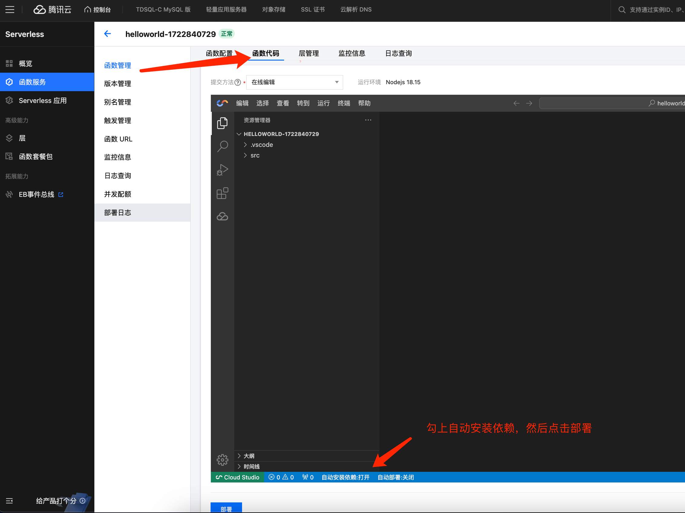
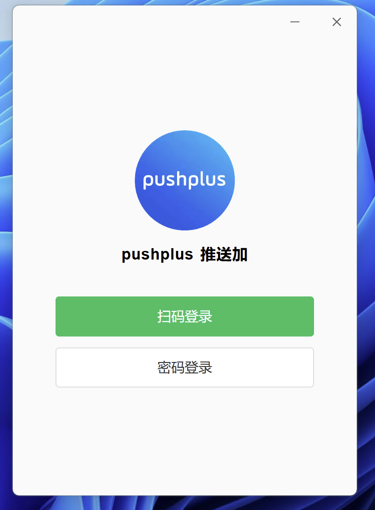
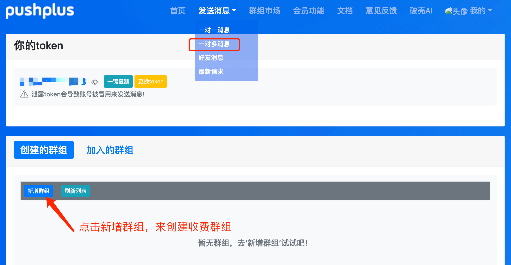
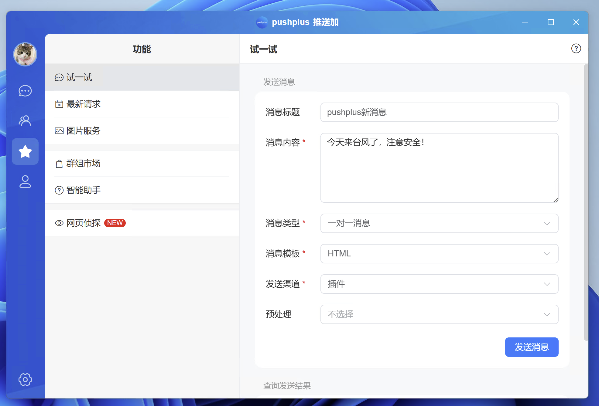
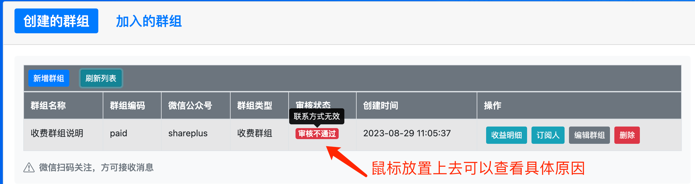
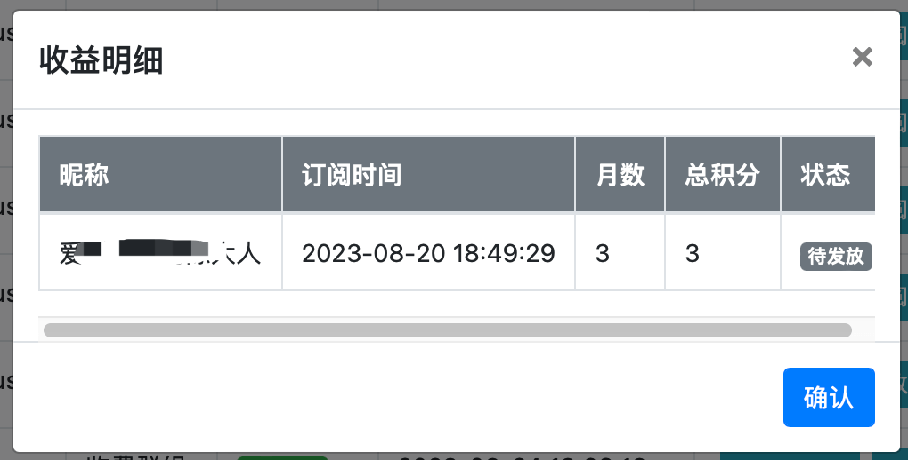
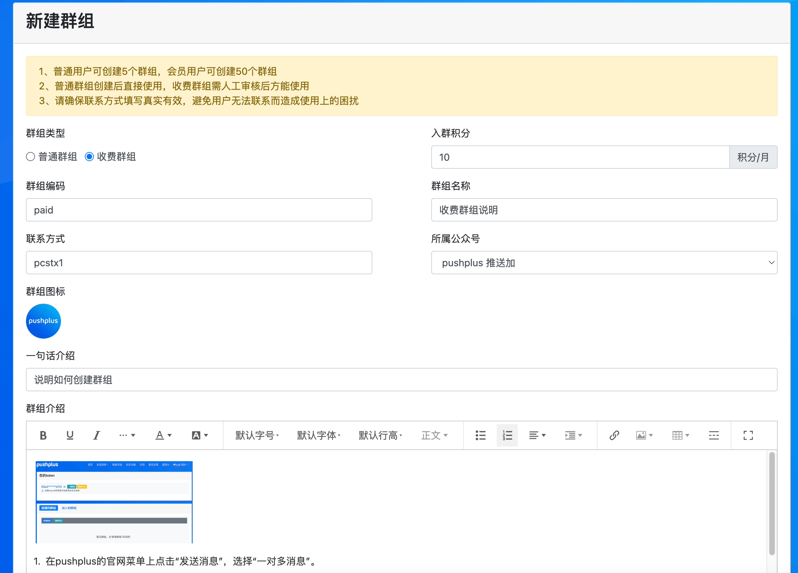
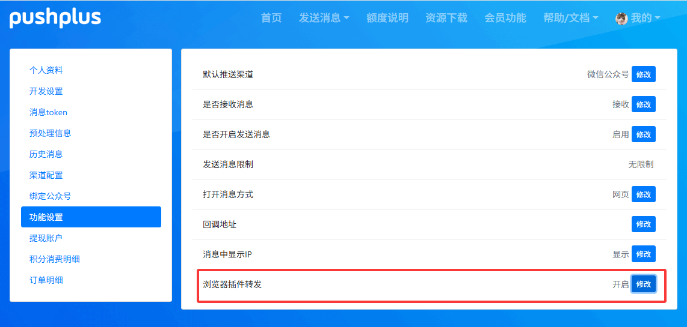

# 桌面应用程序使用教程

## 引言

　&emsp;&emsp;对于日常使用电脑办公的用户，pushplus开发了独立的桌面应用程序来接收消息，相比浏览器插件，免去了需要一直打开浏览器的限制。消息和浏览器插件共用一个渠道，共享请求接口次数。



## 安装

　&emsp;&emsp;手动下载安装包（可到[资源下载](https://www.pushplus.plus/download.md)页面下载最新版本）。\
Windows系统下载地址：[https://www.123865.com/s/3UMBjv-msYUh](https://www.123865.com/s/3UMBjv-msYUh) \
MacOS系统下载地址：[https://www.123865.com/s/3UMBjv-tGYUh](https://www.123865.com/s/3UMBjv-tGYUh)

注意：macos中安装后打开提示已损坏，在终端中运行命令:`sudo xattr -cr /Applications/pushplus\ 推送加.app`

## 使用

1. 登录

- 首次登录使用微信扫描二维码，未关注公众号的情况下需要关注下pushplus公众号。
- 后续同账号再次登录，无需扫码可直接点击登录。



2. 历史消息

- 可以在历史消息中查看收到的所有渠道消息，点击某条消息可以查看消息详情。
- 当有新的插件渠道消息，历史消息中也会同步显示。



3. 发送消息

- 方便测试发送消息功能，支持各种渠道。
- 最新请求中可以查看24小时内最新请求的消息，用于排查收不到消息的问题。



4. 个人中心

- 修改个人资料，维护调用接口的令牌。
- 配置群组（一对多消息）、好友列表（好友消息）和渠道（webhook、短信、邮件、公众号）。
- 推送有关的功能设置。



5. 接收消息

- 接收插件渠道（extension）的消息，有系统级弹框提醒和声音，点击可查看消息详情。



## 发送消息

 
通过pushplus的发送消息接口，与浏览器插件共用同一渠道，渠道参数(channel)指定为extension。具体的请求示例如下：

- 请求地址：http://www.pushplus.plus/send/{token}
- 请求方式：POST
- 请求内容：

```
{
    "token":"{token},
    "title":"消息标题",
    "content":"消息正文内容",
    "channel":"extension"
}
```

- 说明：同样支持一对一、一对多和好友消息。支持一个用户登录多台设备，一次请求会在多台设备上同时接收到。



## 同步接收微信渠道消息

　&emsp;&emsp;在“个人中心” -> “功能设置” -> “插件渠道转发” 中可以开启同步接收微信渠道的消息。也就是发送渠道为微信公众号(wechat)的消息也会在pushplus程序上接收到，无需再请求一次插件(extension)渠道的消息，并且是不计算插件(extension)渠道的请求次数的。


