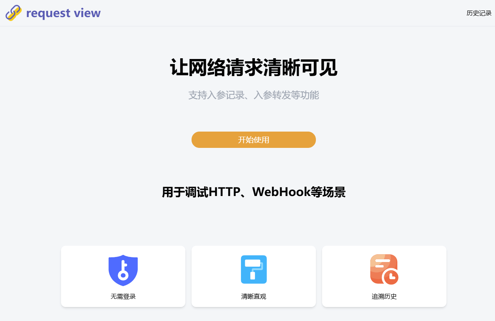
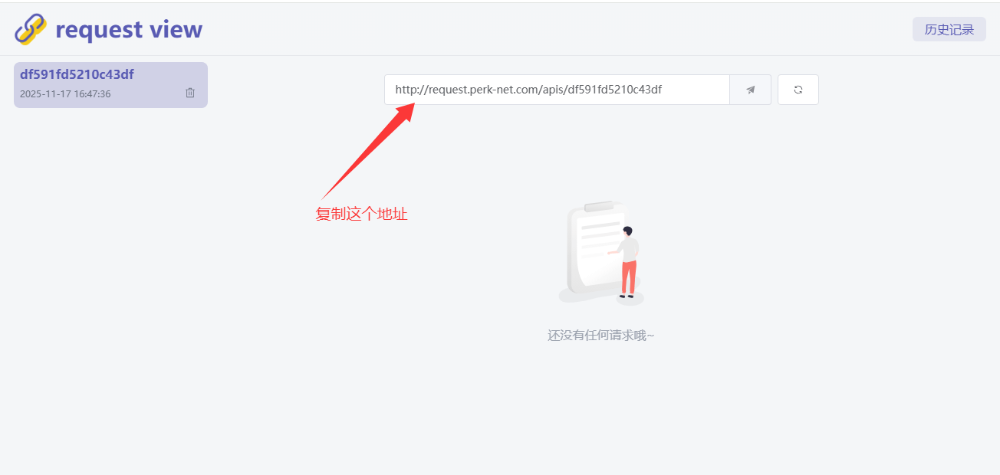
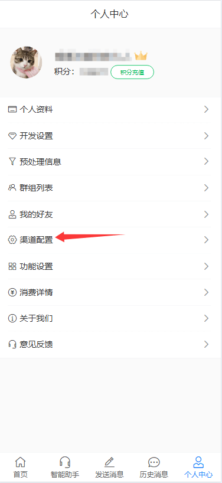
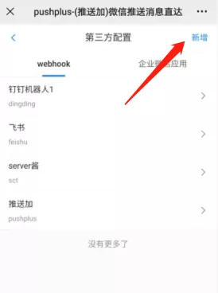
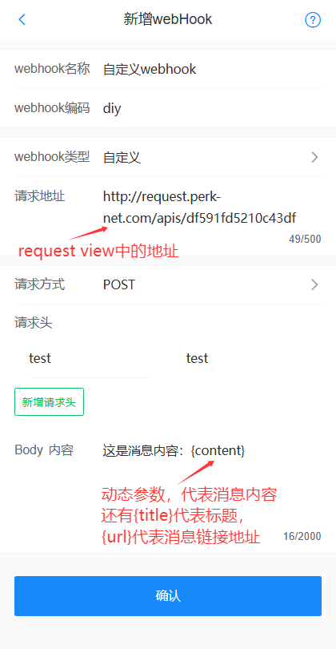
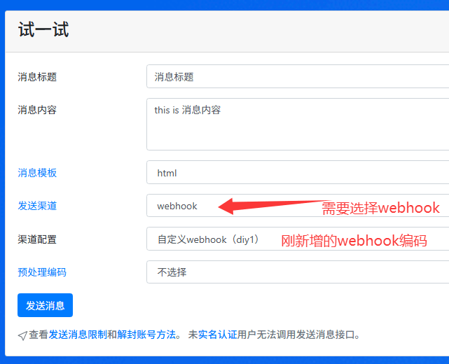
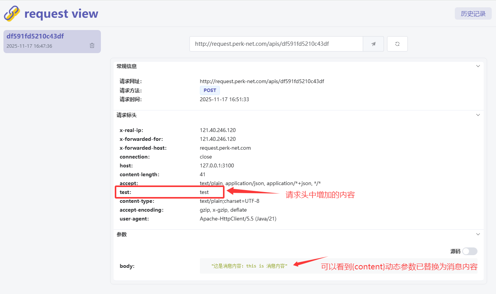

# 自定义webhook配置教程

## 引言
　&emsp;&emsp;webhook渠道中内置了常见的第三方应用，但还有一些自己部署的应用或者小众系统的场景。现在可以通过自定义的方式来实现webhook推送。原理就是在pushplus后台配置页面中配置http请求的参数，当请求pushplus消息接口的时候，pushplus的服务器会根据配置的信息来发起请求到自定义的webhook地址。
 
## 配置示例
request view是一个用于调试http请求的系统。可以提供webhook地址，展示接收到的请求内容。下面以request view为例，来演示如何配置自定义的webhook。

#### 一、request view配置


1. 打开网址：[http://request.perk-net.com/](http://request.perk-net.com/)
2. 点击开始使用。
3. 复制生成的webhook地址，用于后续配置。



#### 二、在pushplus中配置webhook
1. 打开“pushplus 推送加”的公众号，进入公众号菜单上的“功能”->“个人中心”。
2. 在个人中心里打开“渠道配置”。
 


3. 在“webhook”标签页中点击右上角的“新增”按钮。新增一个webhook配置。



4. webhook类型选择“自定义”。
5. 请求地址填写从request view中获取的webhook地址。
6. 请求方式选择POST
7. 请求头中key填写“test”，value填写“test”。目的：仅为了演示下http请求头的效果。
8. Body内容中填写“这是消息内容：{content}”。

系统中内置了三个动态参数：{title}代表消息标题，{content}代表消息内容，{url}代表消息链接地址。



5. 保存完成上述步骤后，相关的配置就完成了。可以在消息发送接口中使用了。

#### 三、发送消息测试


1. 在官网试一试中发送一条消息进行测试，查看效果。
2. 随意填写标题和内容。
3. 发送渠道选择webhook，渠道配置选择刚新增的webhook编码。
4. 点击“发送消息”。然后到request view中点击刷新按钮，查看收到的内容。



#### 四、接口中使用示例
　&emsp;&emsp;发送消息接口主要需要配置两个参数。一个channel参数，固定填写webhook；另一个option参数，填写自己定义的webhook编码（webhookCode）。\
　&emsp;&emsp;具体示例如下：
- 请求地址：https://www.pushplus.plus/send
- 请求方式：POST
- Content-Type: application/json
- 请求body内容：
```
{
    "token":"{token}",
    "title":"标题",
    "content":"消息内容",
    "channel":"webhook",
    "option":"自己定义的webhook编码（webhookCode）"
}
```
