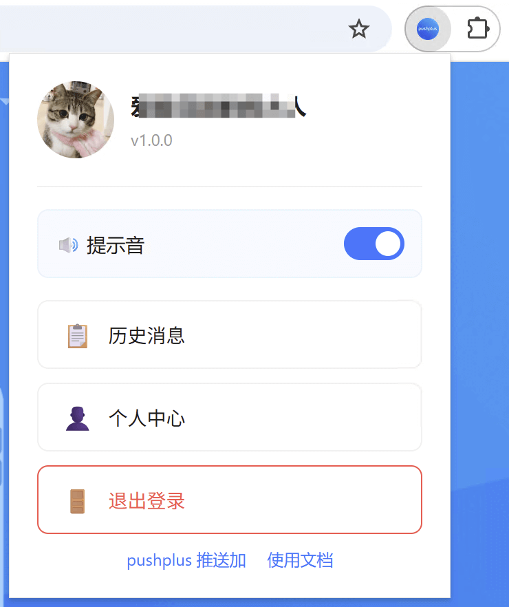
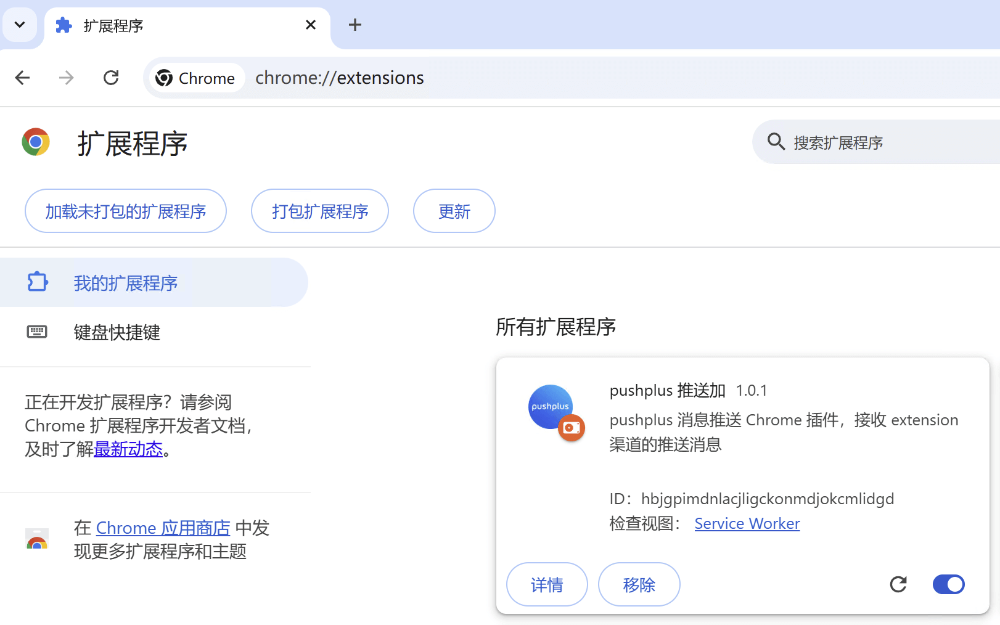
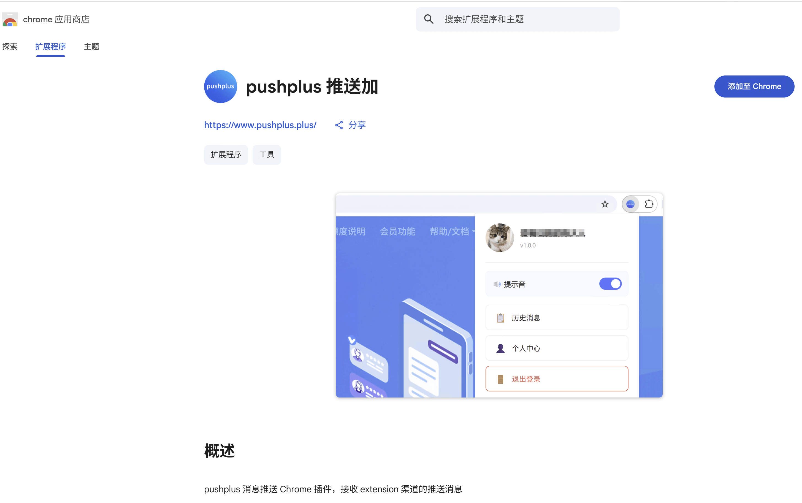
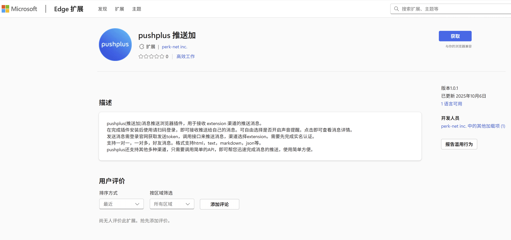
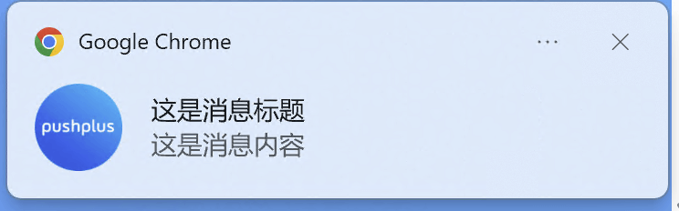
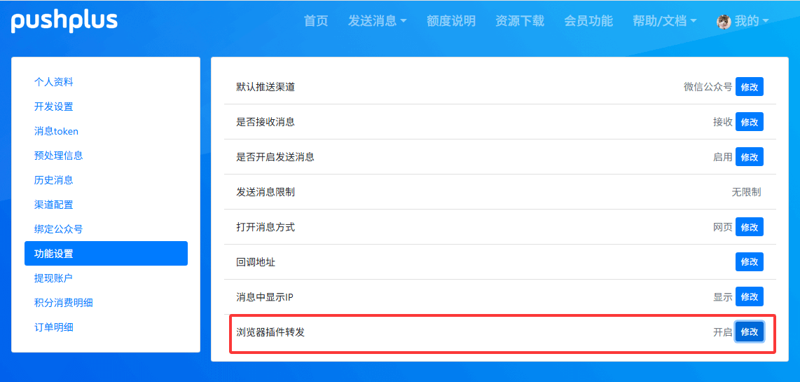

# 浏览器插件使用教程

## 引言
　&emsp;&emsp;chrome内核的浏览器支持用户安装插件，使用pushplus浏览器插件后可以通过浏览器的通知功能来接收推送的消息。在电脑端无需安装其他软件即可方便地接收消息，更加轻量。


 
## 安装
　&emsp;&emsp;浏览器插件可以在chrome应用商店中搜索“pushplus”进行安装。或者直接下载手动安装。

### 手动安装
1. 下载后将压缩包，下载地址：[https://pcstx.lanzouq.com/iCF9F37rl7ri](https://pcstx.lanzouq.com/iCF9F37rl7ri)
2. 打开浏览器的扩展程序管理页面。chrome浏览器地址：[chrome://extensions/](chrome://extensions/)，edge浏览器地址：[edge://extensions/](edge://extensions/)
3. 将下载好的压缩包直接拖入到页面上即可完成安装。

Firefox插件下载地址：[https://pcstx.lanzouq.com/iNtew37zzorc](https://pcstx.lanzouq.com/iNtew37zzorc)
注意：Firefox不支持控制通知声音。



### chrome应用商店
1. 访问chrome应用商店：[pushplus 推送加插件](https://chromewebstore.google.com/detail/pushplus-%E6%8E%A8%E9%80%81%E5%8A%A0/hcohnbbbchgmkjbbpnekdmhaejinpimh?hl=zh-CN&authuser=0)
2. 点击“添加至Chrome”



### Edge浏览器扩展市场
1. 访问Edge扩展项：[pushplus 推送加插件](https://microsoftedge.microsoft.com/addons/detail/pushplus-%E6%8E%A8%E9%80%81%E5%8A%A0/ekidpillenhajafdnbjnnfbolnmfhgep?hl=zh-CN)
2. 点击“获取”



## 使用
### 首次使用
1. 点击浏览器扩展程序栏中的pushplus插件图标
2. 弹出窗口显示登录二维码
3. 使用微信扫描二维码
4. 扫码成功后自动登录并显示用户信息页面

### 日常使用
1. 查看历史消息
- 点击"历史消息"按钮
- 在新标签页打开历史消息页面
2. 个人中心管理
- 点击"个人中心"按钮
- 在新标签页打开个人中心页面
3. 接收推送通知
- 保持插件安装状态
- 有新消息时自动弹出浏览器通知
- 点击通知可快速跳转到历史消息页面
4. 退出登录
- 点击"退出登录"按钮
- 安全退出并返回登录页面

## 发送消息



通过pushplus的发送消息接口，渠道参数(channel)指定为extension即可使用浏览器插件渠道发送消息。具体的请求示例如下：

- 请求地址：http://www.pushplus.plus/send/{token}
- 请求方式：POST
- 请求内容：

```
{
    "token":"{token},
    "title":"消息标题",
    "content":"消息正文内容",
    "channel":"extension"
}
```
- 说明：同样支持一对一、一对多和好友消息。支持一个用户登录多个浏览器设备，一次请求会在多个设备上同时接收到。

## 同步接收微信渠道消息
　&emsp;&emsp;在“个人中心” -> “功能设置” -> “浏览器插件转发” 中可以开启同步接收微信渠道的消息。也就是发送渠道为微信公众号(wechat)的消息也会在浏览器插件上接收到，无需再请求一次浏览器插件(extension)渠道的消息，并且是不计算浏览器插件(extension)渠道的请求次数的。
 


## 相关问题

### 收不到推送通知？
请确保：
1. 已授予插件通知权限
2. 浏览器保持运行状态
3. 检查系统通知设置是否开启
