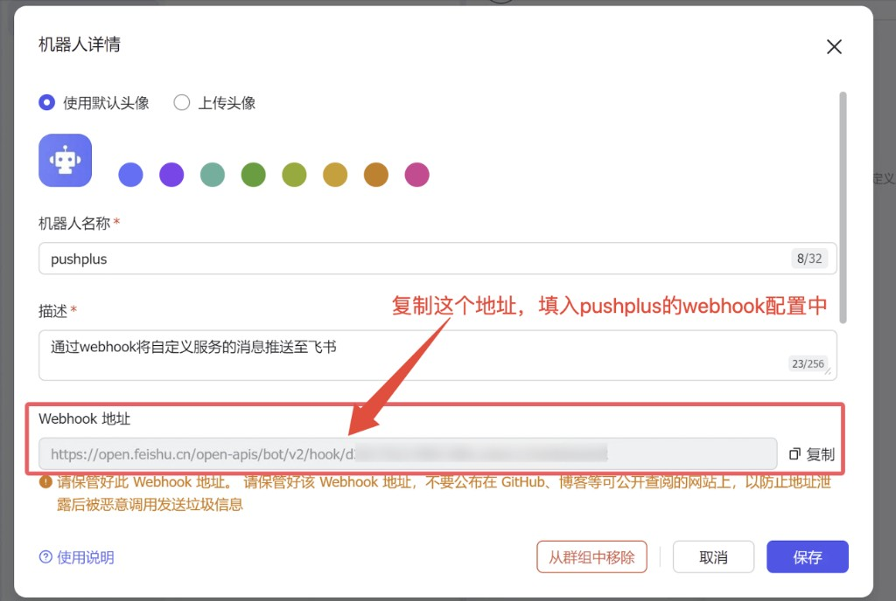
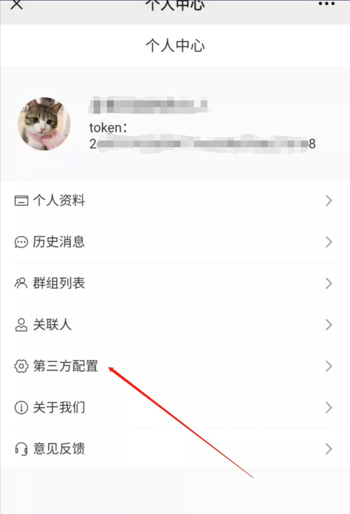

# pushplus推送到飞书机器人教程

## 引言
　&emsp;&emsp;pushplus目前已经实现了将消息推送到飞书机器人渠道。这里演示下具体的操作流程。

## 会员特权
#### 直接显示纯文本内容
会员用户使用飞书机器人在发送模板为txt的情况下，消息会直接以文字的形式发送。其他情况下会使用图文的方式发送。
 
## 使用步骤
#### 一、您需要有一个飞书
　&emsp;&emsp;目前飞书是免费注册的，个人用户也可以直接使用。
下载地址：[https://www.feishu.cn/download](https://www.feishu.cn/download)

#### 二、在飞书群中新增一个群机器人
1. 打开需要添加机器人的飞书群聊，点击右上角的设置按钮，在设置面板中选择“群机器人”。


2. 点击“添加机器人”，在弹出的窗口中选择“自定义机器人”。


3. 填写机器人名称（建议填写“pushplus”）、描述等信息，完成机器人的创建。



#### 三、复制webhook地址
　&emsp;&emsp;复制保存好创建好机器人的Webhook地址，后续配置中需要使用。请妥善保管该地址，不要公布在 GitHub、博客等可公开查阅的网站上，以防止地址泄露后被恶意调用发送垃圾信息。

#### 四、在pushplus中配置webhook
1. 打开“pushplus 推送加”的公众号，进入公众号菜单上的“功能”->“个人中心”。
2. 在个人中心里打开“第三方配置”。



3. 在“webhook”标签页中点击右上角的“新增”按钮。新增一个webhook配置。


4. 填写具体的信息

　&emsp;&emsp;其中webhook名称随便填写，仅方便自己区分；
- webhook编码用于消息发送接口中的“option”参数；
- 请求地址填写第三步中复制的飞书机器人webhook地址；
- 类型选择飞书机器人。


5. 保存完成上述步骤后，相关的配置就完成了。可以在消息发送接口中使用了。

#### 五、接口中使用示例
　&emsp;&emsp;发送消息接口主要需要配置两个参数。一个channel参数，固定填写webhook；另一个option参数，填写自己定义的编码。\
　&emsp;&emsp;具体示例如下：
- 请求地址：https://www.pushplus.plus/send
- 请求方式：POST
- Content-Type: application/json
- 请求body内容：
```
{
    "token":"{token}",
    "title":"标题",
    "content":"消息内容",
    "channel":"webhook",
    "option":"自己定义的编码"
}
```

#### 六、调用成功后即可在飞书上收到对应的消息。
　&emsp;&emsp;飞书上机器人将会用图文消息发送。
