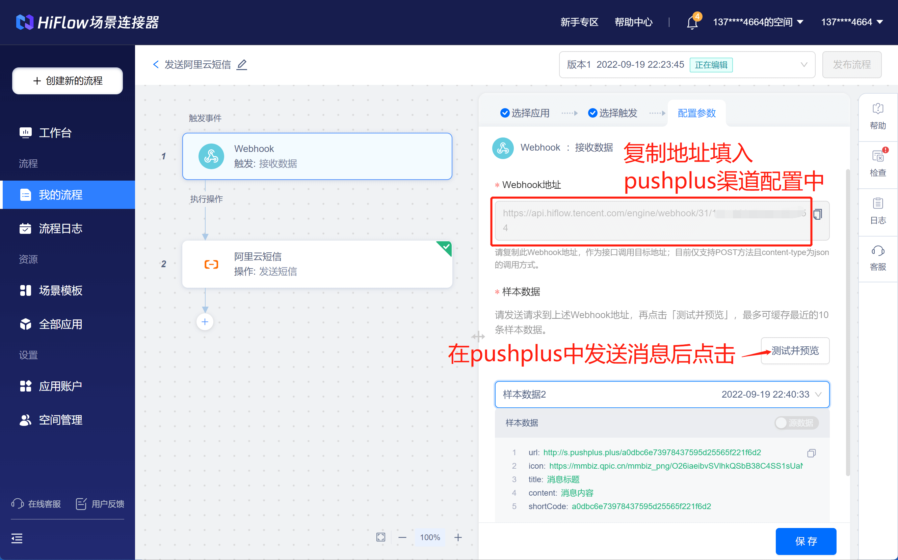
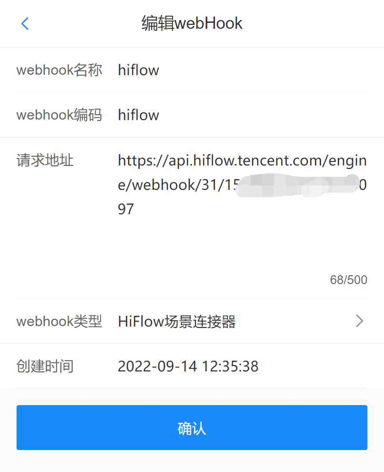
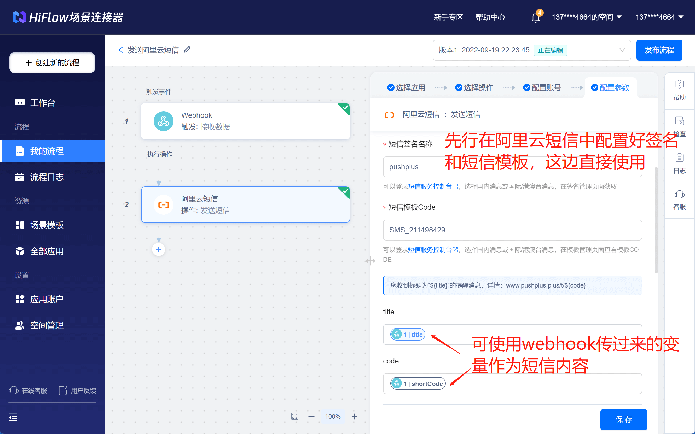
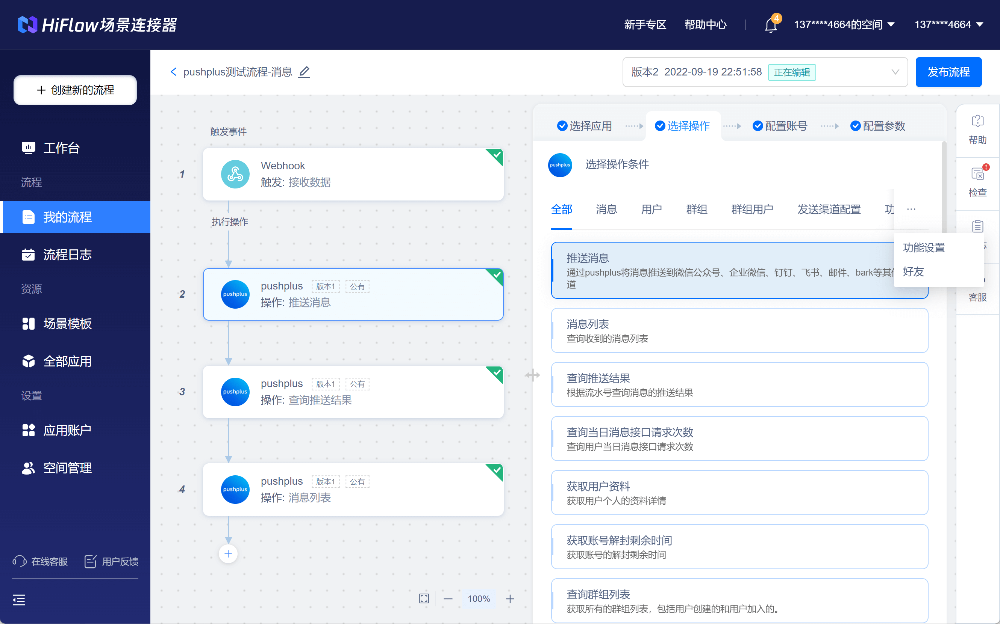

# 通过腾讯轻联实现发送短信

## 引言
　&emsp;&emsp;pushplus只是一个消息通知的工具，能做的事情相对还比较有限，具体的业务功能还需要自己去开发。考虑到大部分使用者并不是开发者，为了降低使用者的开发成本，pushplus与腾讯轻联进行了对接，从而可以通过简单的可视化配置实现丰富多彩的功能。\
　&emsp;&emsp;下面以发送短信为例，展示腾讯轻联的强大。当然您还可以自行实现其他复杂的功能。
 
## 使用步骤
#### 一、访问腾讯轻联官网，创建一个webhook流程
1. 腾讯轻联官网地址：<a href="https://hiflow.tencent.com/" target="_blank">https://hiflow.tencent.com/</a>，登录后点击“控制台”->"我的流程"->“从零开始创建”

2. 触发时间选择应用“Webhook”，选择触发点击“接收数据”，在配置参数中会获取一个“Webhook地址”。需要使用这个地址填入pushplus的渠道配置中。



3. 打开“pushplus 推送加”的公众号，进入公众号菜单上的“功能”->“个人中心”->“渠道配置”->“webhook”。在“webhook”标签页中点击右上角的“新增”按钮。新增一个webhook配置。\
填写具体的信息:
- webhook名称：随便填写，仅方便自己区分；
- webhook编码：用于消息发送接口中的“webhook”参数；
- 请求地址：填写上一步获取到的“Webhook地址”；
- webhook类型：下拉选择“腾讯轻联”。



4. 可以在官网上发送一个消息请求，选择刚新增的webhook渠道。发送完成后，回到腾讯轻联的流程中继续配置。

5. 点击腾讯轻联流程中的“测试并预览”，因为刚发送了一条消息，所以会有一条样本数据展示出来，里面展示了5个参数，这5个参数可以在后续自定义应用中作为变量使用。

6. 这边有个前提，您需要提前有阿里云账号，并开通了阿里云短信功能，配置好了短信签名和短信模块。具体操作可以参考阿里云官网文档。当然如果您使用腾讯云短信腾讯轻联也是支持的。

7. 在执行操作中新增“阿里云短信”应用，选择“发送短信”操作，然后配置好自己的账号。在配置参数中可以将“webhook”中获取的样本数据字段作为变量填入短信模板中使用。



#### 二、接口中使用示例
　&emsp;&emsp;接口上与微信渠道不同的是新增了两个参数。一个channel参数，填写固定值webhook；另一个webhook参数，填写上一步配置中自己定义的webhook编码。
　&emsp;&emsp;具体示例如下：
- 请求地址：http://www.pushplus.plus/send
- 请求方式：POST
- Content-Type: application/json
- 请求body内容：
```
{
    "token":"{token}",
    "title":"标题",
    "content":"消息内容",
    "channel":"webhook",
    "webhook":"自定义的webhook编码"
}
```

#### 三、发送给腾讯轻联的参数说明
　&emsp;&emsp;整个过程实现的原理是用户通过pushplus会发送消息后，pushplus会向配置的腾讯轻联的“webhook”地址发送一个post请求，从而触发腾讯轻联的流程，后续的发送短信流程均有腾讯轻联自身程序逻辑实现，与pushplus无关。\
请求的具体参数如下：
```
{
    "title": "pushplus标题",
	"content": "pushplus内容",	
    "icon": "https://mmbiz.qpic.cn/mmbiz_png/O26iaeibvSVlhkQSbB38C4SS1sUaNHaibgqwgmsiaIQLv5"
	"url": "http://s.pushplus.plus/6b65eaa2a052",
    "shortCode": "6b65eaa2a052"
}
```
- title：消息标题
- content：消息内容
- icon：pushplus图标
- url：消息链接地址
- shortCode：消息短链码，可用于拼接消息地址
 
## 更多应用场景
　&emsp;&emsp;除了可以通过webhook来触发腾讯轻联的流程以外，pushplus也集成到了腾讯轻联的流程中，成为了一款应用，并提供了大量功能。配置账号的时候需要先在pushplus的“开发设置”中配置好密钥等信息。具体落地应用场景请自行研究探索。\
访问地址：<a href="https://qinglian.tencent.com/apps/list/" target="_blank">https://qinglian.tencent.com/apps/list/</a>

 