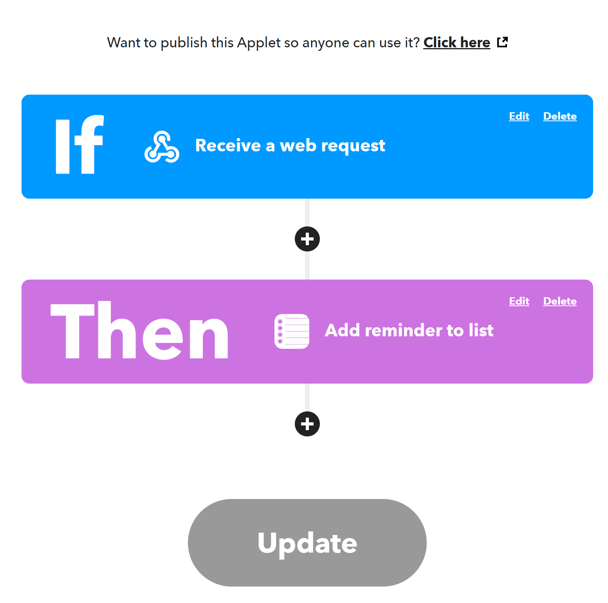
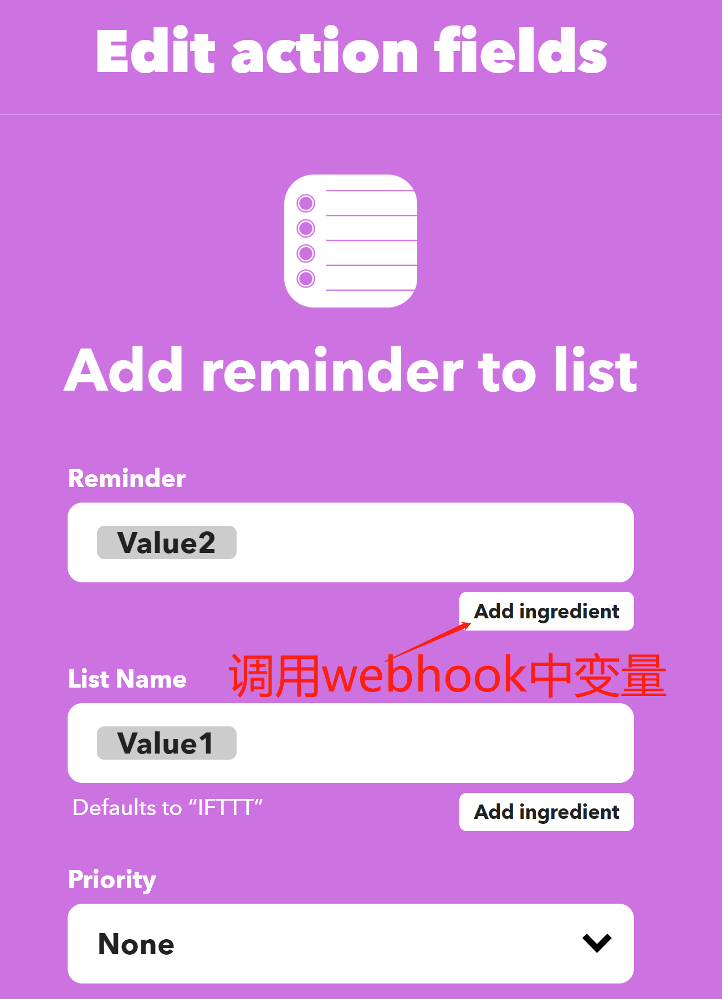
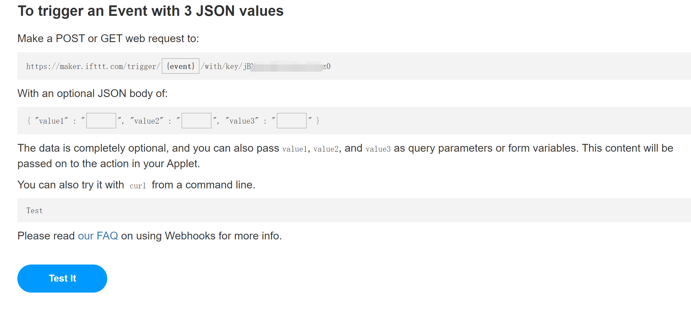
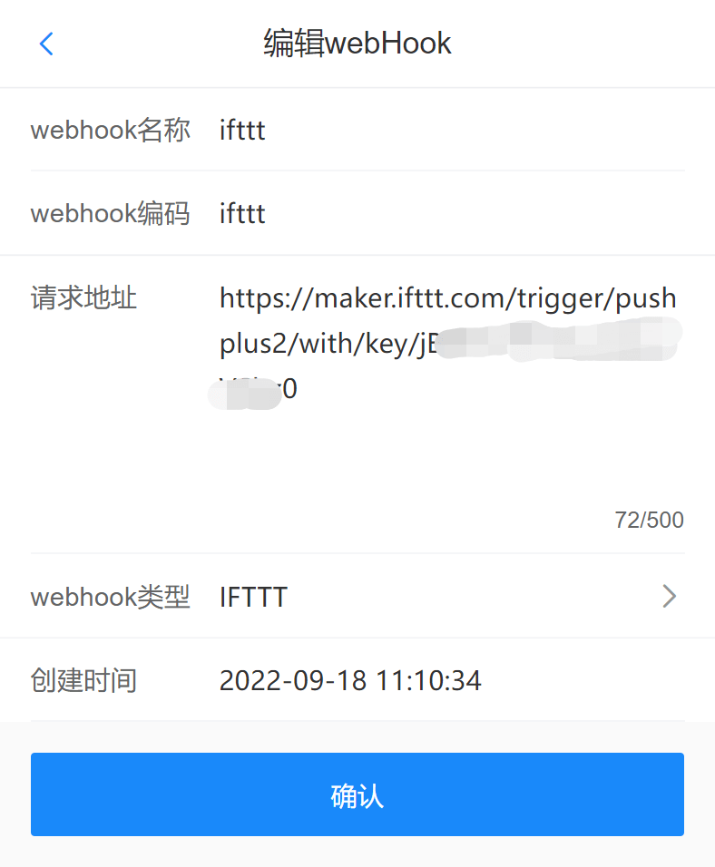
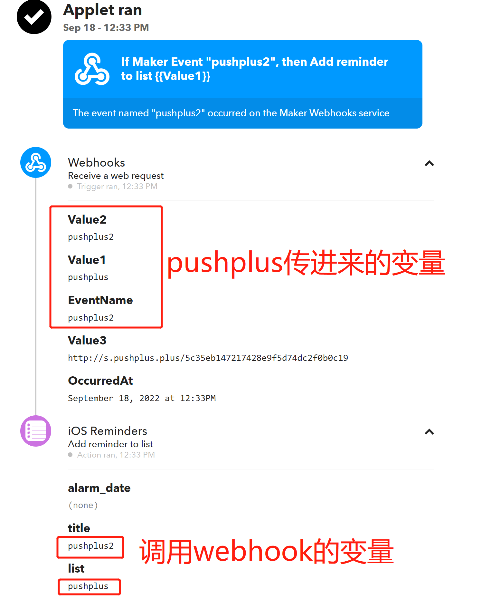

# 调用IFTTT的webhook触发器教程

## 引言
　&emsp;&emsp;<a href="https://ifttt.com/explore" target="_blank">IFTTT</a>是国外的一款开放API接口平台，可以自由的配置触发器调用动作来灵活的实现各种场景功能。比如可以实现通过pushplus发一条消息来打开自己家里的灯。
 
## 使用步骤
#### 一、配置IFTTT
　&emsp;&emsp;这边以配置触发器为webhook，动作为增加一个ios提醒为例。



1. 打开IFTTT官网，登录网站后，点击右上角的“Create”创建一个自己的应用。
2. 点击“If This”中的“add”，然后搜索“webhooks”,选择“Receive a web request”,然后输入一个自定义的事件名称，比如“pushplus”，这个会用于后续webhook请求地址中的变量;完成后点击“Create trigger”。
3. "Then That"中新增“ios Reminders”，创建一个ios系统的提醒事件。其中选型内容可以自定义，也可以点击“add ingredient”来增加上一步webhook传进来的值。
- value1：pushplus消息的标题
- vaule2: pushplus消息的内容
- value3: pushplus消息的链接地址



4. 获取自己的webhook请求地址
IFTTT的请求地址规则是：https://maker.ifttt.com/trigger/{event}/with/key/{key} 
- 其中{event}是上一步创建的“webhooks”的事件名称
- {key}是系统自动生成的，可以在 https://ifttt.com/maker_webhooks/settings 中找到“URL”,点击链接地址后，会打开一个webhook请求说明页面，里面就有请求地址。
 
 

#### 二、在pushplus中配置webhook
1. 打开“pushplus 推送加”的公众号，进入公众号菜单上的“功能”->“个人中心”->“渠道配置”->“webhook”
2. 在“webhook”标签页中点击右上角的“新增”按钮。新增一个webhook配置。
3. 填写具体的信息
- webhook名称：随便填写，仅方便自己区分；
- webhook编码：用于消息发送接口中的“webhook”参数；
- 请求地址：填写从IFTTT网站中配置的地址；
- webhook类型：下拉选择“IFTTT”。



4. 保存完成上述步骤后，相关的配置就完成了。可以在消息发送接口中使用了。

#### 三、接口中使用示例
　&emsp;&emsp;接口上与微信渠道不同的是新增了两个参数。一个channel参数，填写固定值webhook；另一个webhook参数，填写上一步配置中自己定义的webhook编码。
　&emsp;&emsp;具体示例如下：
- 请求地址：http://www.pushplus.plus/send
- 请求方式：POST
- Content-Type: application/json
- 请求body内容：
```
{
    "token":"{token}",
    "title":"标题",
    "content":"消息内容",
    "channel":"webhook",
    "webhook":"自定义的webhook编码"
}
```

#### 四、调用完成可以在IFTTT上查看请求历史。
　&emsp;&emsp;pushplus会将请求的报文封装成如下格式发送给IFTTT。可以在已创建的应用中点击“View activity”查看日志。
```
{
    "value1": "pushplus标题",
	"value2": "pushplus内容",	
	"value3": "http://s.pushplus.plus/6b65eaa2a052"
}
```
其中value1代表标题，value2代表内容，value3代表消息链接地址。可以在IFTTT的后续动作中使用这三个变量值。


 