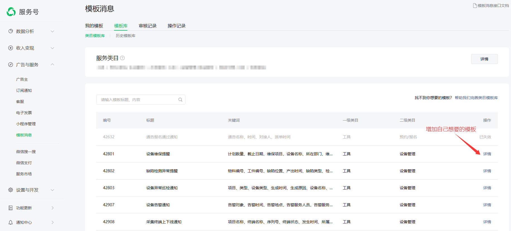

# 绑定自己的微信公众号流程

## 引言

　&emsp;&emsp;pushplus已经支持使用自己的微信公众号，来推送消息了。因为使用的是公众号模板消息来实现的消息推送，所以在使用之前，请先确认自己的公众号是否是已经通过微信认证的服务号。

## 使用说明
1. 个人的、未认证的公众号是不支持消息推送的，请勿绑定。
2. 需要开通会员才能使用，最多可以绑定5个公众号。开通会员：[http://www.pushplus.plus/vip.html](http://www.pushplus.plus/vip.html)
3. 解绑请到微信公众号平台进行取消授权操作。
4. 使用小程序接收通知需要在公众号后台关联“pushplus 推送加”小程序。[操作说明](https://developers.weixin.qq.com/miniprogram/introduction/#%E5%85%AC%E4%BC%97%E5%8F%B7%E5%85%B3%E8%81%94%E5%B0%8F%E7%A8%8B%E5%BA%8F)

## 使用步骤
　&emsp;&emsp;具体使用方法分为四步骤，第一步提前增加好公众号模板，第二步将公众号授权给pushplus，第三步需要配置好模板消息，最后一步配置中选择自己的公众号。

### 一. 在公众号后台增加模板
打开[微信公众号后台](https://mp.weixin.qq.com/advanced/tmplmsg)，进入模板消息设置页面，从模板库中增加自己想要的模板，用于推送消息。

### 二、将公众号授权到pushplus
&emsp;&emsp;登录pushplus官网，访问个人中心->[绑定公众号](https://www.pushplus.plus/uc.html?midx=7)。点击“新增公众号”按钮，扫码选择要绑定的公众号，同意授权绑定。

&emsp;&emsp;也可以在“pushplus 推送加”公众号底部菜单中点击“功能”-> “个人中心”-> “渠道配置”->“微信公众号”。点击“新增”，选择自己的公众号，同意授权绑定。

### 二、配置微信公众号模板消息
&emsp;&emsp;授权公众号后，点击“消息配置”按钮。内置了几个推送消息时候使用的模板，点击“设置”按钮来针对性的配置不同的模板。如未配置模板，调用发送消息接口的时候会失败。比如正常发送消息调用的是“普通消息”模板，只有配置了的情况下才能发送消息。

&emsp;&emsp;在“模板设置”中，可以选择第一步中自己公众号中增加的模板，然后配置每个参数值的内容。可以手动编写固定文本，也可以插入系统内置的变量。注意：微信公众号的类目模板对内容有较多的限制，请根据“参数名称”合理配置，否则将无法推送，比如参数名称为time15，参数值如果配置了非时间类型的数据，将会推送失败	。具体查看：[类目模板消息
](https://developers.weixin.qq.com/doc/offiaccount/Message_Management/Template_Message_Interface.html#%E7%B1%BB%E7%9B%AE%E6%A8%A1%E6%9D%BF%E6%B6%88%E6%81%AF)

### 三、配置使用自己的公众号
使用配置分为一对一消息和一对多消息。\
1）一对一消息配置\
&emsp;&emsp;需要先绑定OpenId，在绑定的公众号中点击“绑定OpenId”按钮，扫码关注自己的公众号，否则无法接收到消息。

&emsp;&emsp;在“pushplus 推送加”公众号底部菜单中点击“功能”-> “个人中心”-> “默认推送配置”。\
&emsp;&emsp;推送渠道选择“微信公众号”，渠道参数选择您授权绑定的公众号。点击确认完成设置。\
&emsp;&emsp;注：1. 如渠道参数中没有您绑定的公众号，请确认公众号是否是已认证的服务号，并已配置好模板消息。

2）一对多消息配置\
&emsp;&emsp;使用一对多消息的时候，需要先创建群组。创建群组的时候可以直接选择自己绑定的公众号。然后用户扫描群组二维码加入群组即可。\
&emsp;&emsp;注：已创建的群组无法修改公众号，请谨慎创建。

### 四、解绑公众号

&emsp;&emsp;如需要将公众号从pushplus解除绑定，可以从微信公众号平台-> 公众号设置 -> 授权管理，选择“pushplus 推送加”进行取消授权。取消授权后，原来使用自己公众号的群组将无法发送消息。

### 五、小程序接收消息配置
&emsp;&emsp;使用小程序接收消息需要在微信公众号后台中关联“pushplus 推送加”的小程序。否则会导致消息成功无法发送的情况，错误提示：“不合法的 AppID ，请开发者检查 AppID 的正确性，避免异常字符，注意大小写”。
[点击查看具体操作](https://developers.weixin.qq.com/miniprogram/introduction/#%E5%85%AC%E4%BC%97%E5%8F%B7%E5%85%B3%E8%81%94%E5%B0%8F%E7%A8%8B%E5%BA%8F)

