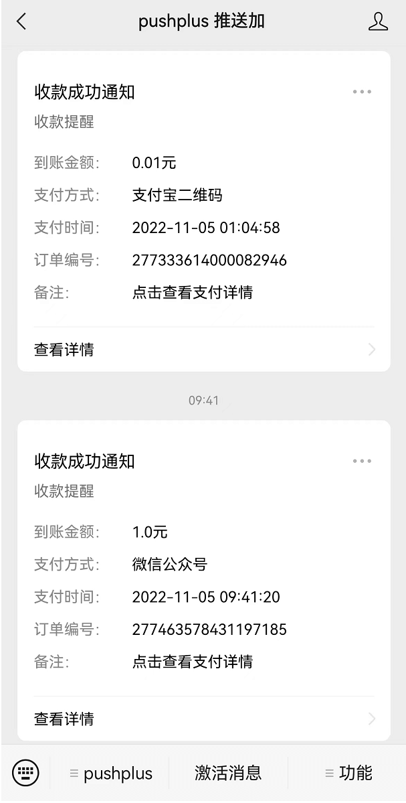
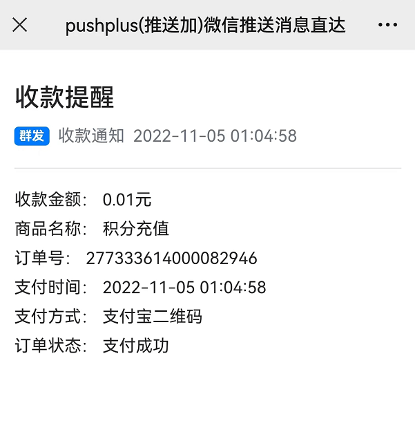

# 支付成功通知模板使用

## 引言
　&emsp;&emsp;为了在微信、支付宝等在线渠道收款后在一个地方收到通知提醒，pushplus新增了支付成功通知模板。使用此模板可以在微信中接收收款情况。

## 使用方法
　&emsp;&emsp;在微信或支付宝支付回调接口中通过代码调用pushplus的发送消息接口，来实现微信公众号的模板消息提醒功能。\
效果如下：





#### 请求示例，POST方式推送消息
- 请求地址：http://www.pushplus.plus/send/
- 请求方式: POST
- Content-Type: application/json
- 请求内容：

```
{
    'token':'{token}',
    'title':'收款通知',
    'template':'pay',
	'content':'{
                    "amount": "20元",
                    "payWay": "微信",
                    "successTime": "2012-11-14 22:40:22",
                    "orderNo": "254864540",
                    "name":"商品名称",
                    "payState": "支付成功"                  
                }'
}
```
- 说明：template参数指定为pay；具体使用的时候将请求内容中的{token}替换成自己的用户token或消息token

#### content参数说明

参数名称 | 模板中展示  | 说明
---|--- |--- 
amount | 是 |  收款金额
payWay |  是 |  支付方式
successTime | 是 | 支付时间
orderNo |  是 | 订单号
name |  否 |  商品名称
payState |  否 | 订单状态

#### 其他请求示例

- 请求地址：http://www.pushplus.plus/send/?token={token}&title=收款通知&template=pay
- 请求方式: POST
- Content-Type: application/json
- 请求内容：

```
{
    "amount": "20元",
    "payWay": "微信",
    "successTime": "2012-11-14 22:40:22",
    "orderNo": "254864540",
    "name":"商品名称",
    "payState": "支付成功"                  
}
```
- 说明：POST请求的Body中仅填入支付相关信息，其他参数放到url地址上。
