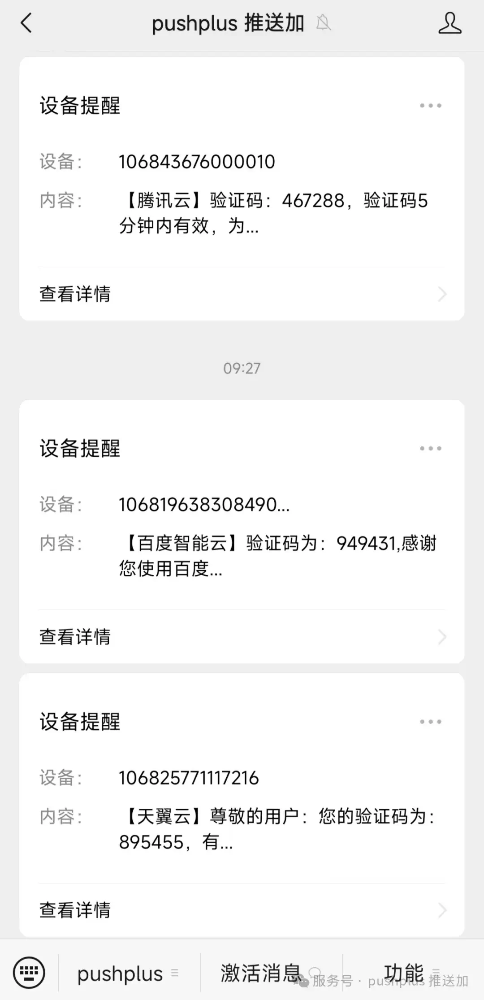
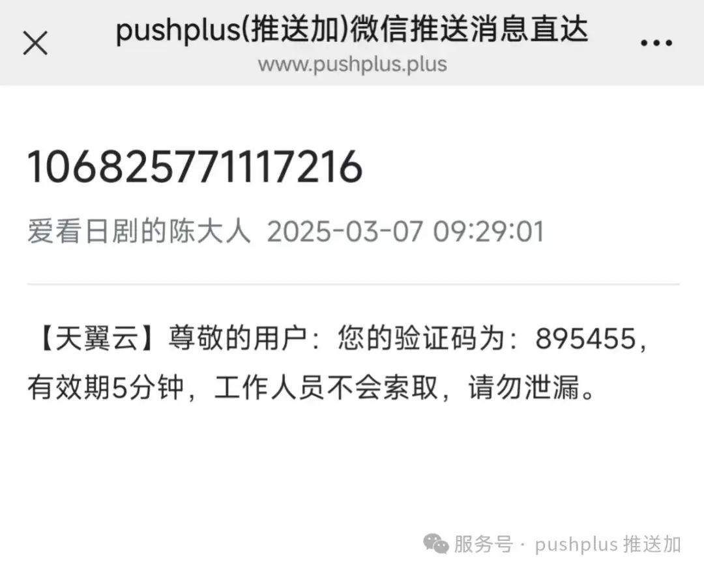
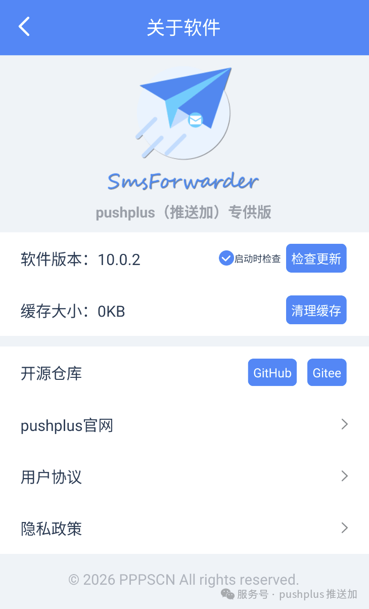
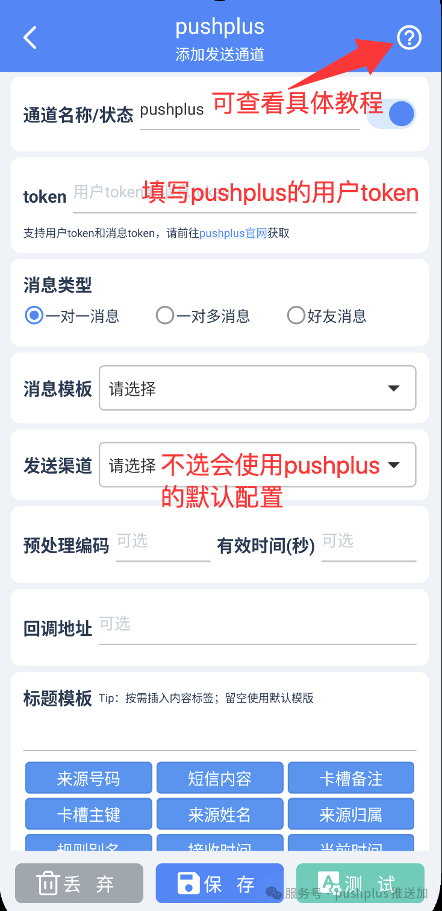
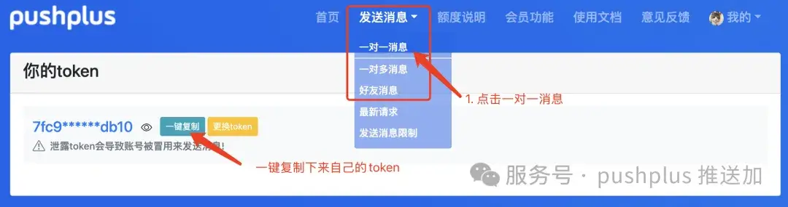
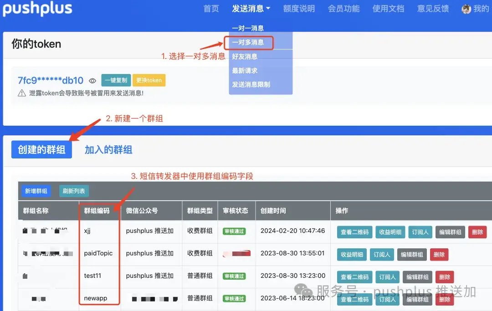
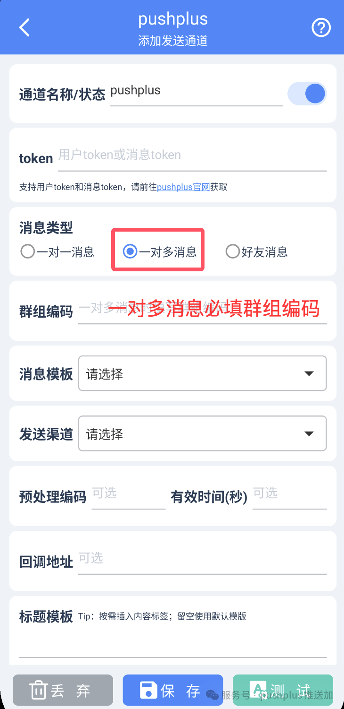
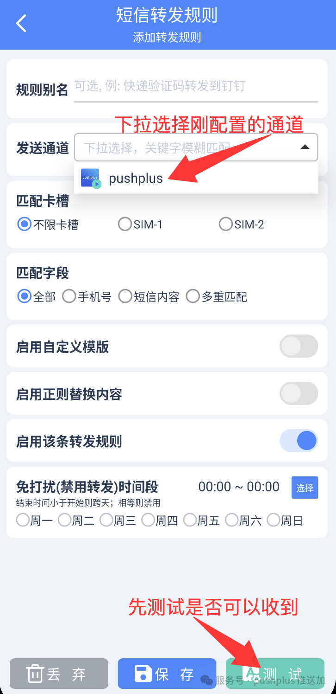
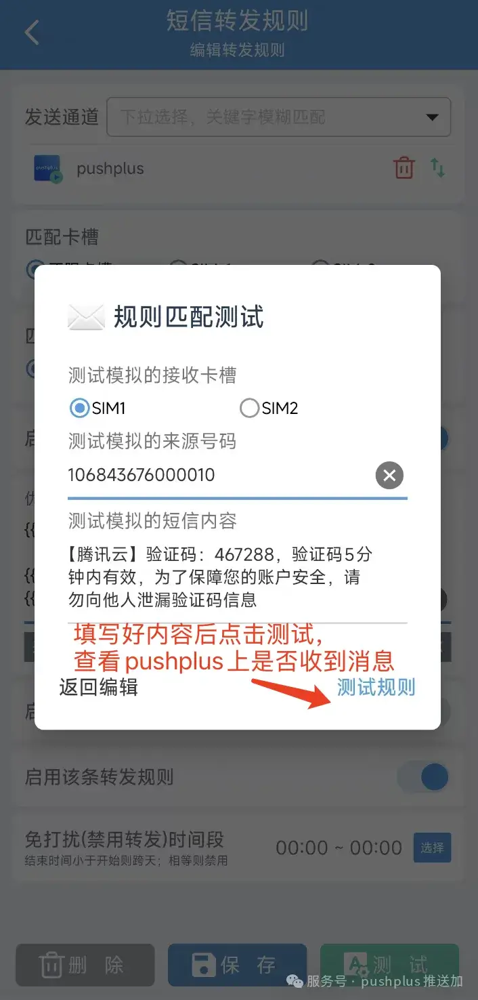
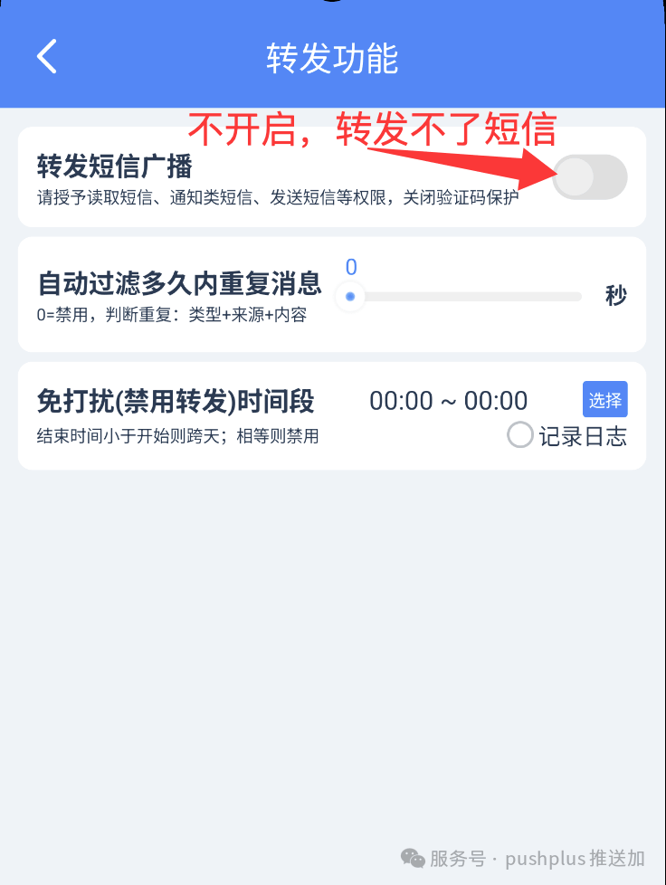

# 如何使用pushplus来接收短信内容

## 引言
　&emsp;&emsp;通过以下的配置，可以实现将自己手机短信中的内容自动的转发到微信上，通过pushplus的渠道来在微信上接收安卓手机中的短信。

## 效果预览
　&emsp;&emsp;最终的效果如下：

**【pushplus公众号中接收到的消息列表】**

**【pushplus消息详情】**

## 前提条件
- 1）手机必须是安卓系统，无需root权限。
- 2）手机需要能够安装app。
- 3）已在pushplus官网上登录，获取到了发消息的token。

## 使用步骤
　&emsp;&emsp;下面就开始具体的配置操作。

#### 一、手机上安装“SmsForwarder pushplus（推送加）专供版 ”app
　&emsp;&emsp;需要在手机上安装“SmsForwarder pushplus（推送加）专供版”这款app，仅支持安卓手机，不支持ios系统。请自行安装到手机上。

　&emsp;&emsp;注意：一定要是“pushplus（推送加）专供版”，而不是其他网站上搜索下载的“短信转发器”版本！

 

Github(国外)：[https://github.com/perk-net/SmsForwarder](https://github.com/perk-net/SmsForwarder)

Gitee(国内)：[https://gitee.com/pushplus/SmsForwarder](https://gitee.com/pushplus/SmsForwarder)

123网盘: [https://1822104859.share.123pan.cn/123pan/3UMBjv-sFPlh](https://1822104859.share.123pan.cn/123pan/3UMBjv-sFPlh)
 
下载好后请自行安装到手机上。

#### 二、配置短信转发器设置
　&emsp;&emsp;安装好app后，打开短信转发器。底部有四个标签页，选择“发送渠道”，新增pushplus发送通道。

- 通道名称/状态字段：随便取个名字。
- token：从pushplus官网上可以获取后填入。
- 其他信息保持默认，无需修改。

　&emsp;&emsp;以上信息填写完成后保存设置。在保存之前可以点击底部“测试”按钮，测试下pushplus公众号上是否能够接收到消息。

如测试按钮点击后无法收到，可以参考文章排查：[收不到消息如何排查？](/help/message.md)

#### 三、pushplus的用户令牌获取方式如下：
1. 登录pushplus官网：[https://www.pushplus.plus](https://www.pushplus.plus)
2. 微信扫码登录
3. 选择发送消息->一对一消息页面
4. 一键复制“你的token”中的内容

　&emsp;&emsp;如果需要多人同时接收短信内容，可以在pushplus中使用一对多消息，创建一个群组，在短信转发器pushplus渠道中的群组编码中填入新建的群组编码。

　&emsp;&emsp;需要接收消息的用户需要扫描群组二维码加入到群组中。注意：创建群组的用户也需要扫码！

#### 四、配置转发规则
　&emsp;&emsp;新增好发送通道后，还需要增加转发规则。切换到转发规则标签中，新增一个短信转发规则。\
　&emsp;&emsp;发送通道：选择刚创建的pushplus发送通道。\
　&emsp;&emsp;其他信息可以保持默认，或者根据自己情况修改。

　&emsp;&emsp;保存转发规则之前，可以点击“测试”按钮来预览最终效果。

#### 五、开启短信转发广播
　&emsp;&emsp;最后到“通用设置”->“转发功能”中开启“转发短信广播”。通过以上几步，就可以正常通过pushplus来接收手机上的短信内容了。如在使用中碰到没有转发的情况，可以根据以下思路来一步步排查。

 

　&emsp;&emsp;如在“转发日志”中都没有短信内容的记录，那就是转发器的问题，可能手机权限没有开启，App后台运行的时候被系统杀死等。如点击测试按钮中都没有成功，可以排查pushplus渠道的问题。可以参考文章排查：[收不到消息如何排查？](../help/message.md)
