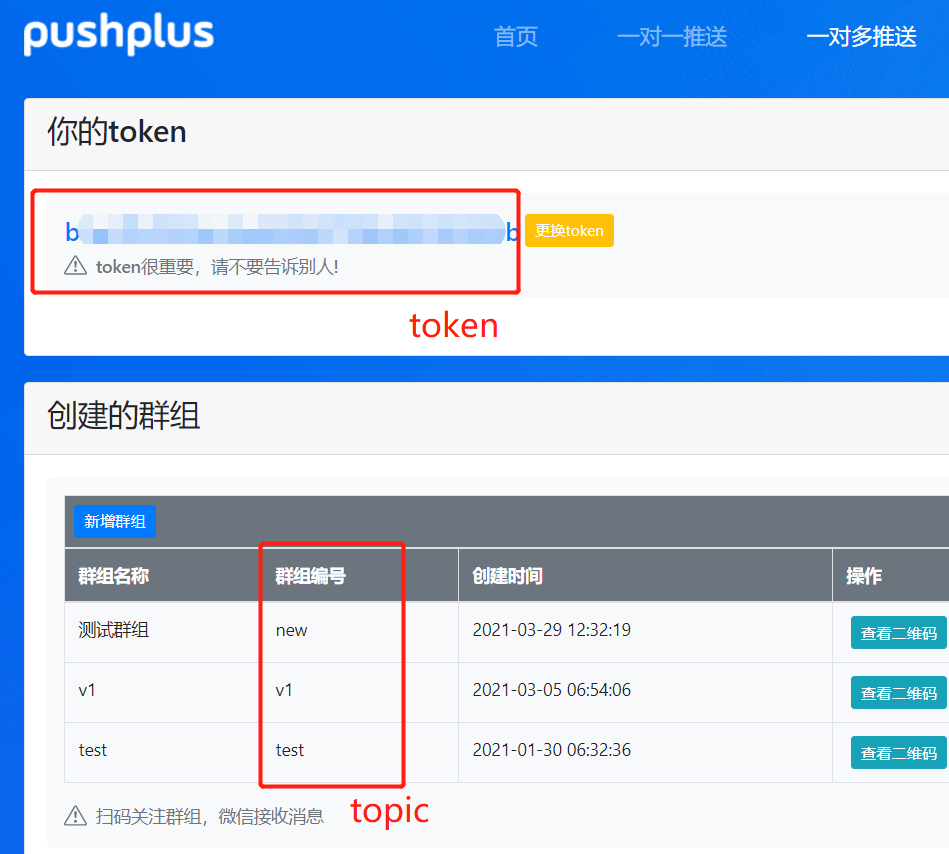

# 使用「网页侦探」+「pushplus」来监控黄金价格变化

## 引言
　&emsp;&emsp;想买点黄金，又不想天天盯着行情页刷新——价格合适了要第一时间知道，价格不动的时候完全不想被打扰。把「网页侦探」和「pushplus」搭在一起，就能做到：每隔 10 分钟自动看一眼金投网现货黄金价格，跌破 860 或突破 890 时，微信立刻收到提醒；其余时间安安静静，不发一条消息。

　&emsp;&emsp;整条链路很简单：

> 网页侦探定时采集黄金价格 → 命中阈值规则 → 通过 pushplus 推送到微信。

　&emsp;&emsp;下面从零搭起来，大约 5 分钟。

## 前提条件
- 1）已安装并登录 [网页侦探](https://webdiff.perk-net.com/) 客户端（Windows / macOS / Linux 均可，安装见[官网下载页](https://webdiff.perk-net.com/download)）。
- 2）已在 [pushplus 官网](https://www.pushplus.plus/) 微信扫码登录，拿到发消息用的 **token**。

## 使用步骤

#### 一、在网页侦探中配置 pushplus 通知渠道
　&emsp;&emsp;通知往哪儿推，是在「通知渠道」里统一管理的，任务本身只负责勾选用哪个渠道。所以先把 pushplus 渠道配好，后面建任务时直接勾选即可。

　&emsp;&emsp;打开网页侦探客户端，点右上角 **「我的」→ 通知渠道**，查看列表里是否已有 pushplus：

　&emsp;&emsp;如果还没有，点右上角 <kbd>+ 添加渠道</kbd>，类型选 **pushplus**，把在 pushplus 官网拿到的 **token** 填进去。保存前先点一下 <kbd>测试</kbd>，微信能收到一条测试消息，就说明通了。

**token 获取方式：**

1. 登录 [https://www.pushplus.plus](https://www.pushplus.plus)
2. 微信扫码登录
3. 进入「发送消息」→「一对一推送」页面
4. 一键复制「你的 token」

　&emsp;&emsp;需要多人同时接收时，可在 pushplus 中创建群组，把群组编码填到网页侦探 pushplus 渠道的「群组编码」字段（留空则为一对一推送）。

　&emsp;&emsp;渠道搞定后，下面开始建黄金价格监控任务。

#### 二、新建任务，选择「网站内容监控」
　&emsp;&emsp;回到「监控任务」列表，点击左上角 <kbd>+ 新增任务</kbd>。

　&emsp;&emsp;在类型卡片中选择「**网站内容监控**」，点击 <kbd>下一步</kbd>。

#### 三、填写任务名称与网址
　&emsp;&emsp;本例监控金投网现货黄金实时价格，网址为：https://quote.cngold.org/gjs/gjhj_xhhj.html?key=au

- **任务名称**：填写 `黄金价格`（同一账号下不可重名）
- **运行客户端**：保持默认「单节点」即可
- **网址**：协议选择 `https://`，粘贴 `quote.cngold.org/gjs/gjhj_xhhj.html?key=au`
- **User-Agent**：保持默认桌面 Chrome 即可

　&emsp;&emsp;可点击网址右侧的 <kbd>预览</kbd> 先确认页面能正常打开，再继续。

#### 四、Cookie 与前置操作（本例跳过）
　&emsp;&emsp;行情页是公开页面，不需要登录态，Cookie 步骤直接点 <kbd>下一步</kbd> 跳过。价格在页面加载后直接可见，也不需要点击、滚动等交互，前置操作两个开关都保持关闭，继续 <kbd>下一步</kbd>。

#### 五、选择监控元素
　&emsp;&emsp;这是最关键的一步。有两种方式指定要监控的价格元素：

**方式一：可视化点选（推荐）**

1. 点击 <kbd>打开预览窗口</kbd>，客户端会用内嵌浏览器加载行情页
2. 在预览窗口顶部工具栏点击 <kbd>选择元素</kbd>，进入点选模式
3. 鼠标移动到 **实时价格数字** 上，元素会以红框高亮
4. 点击选中后，系统自动生成选择器；点击 <kbd>完成选择</kbd> 退出

**方式二：手动填写 XPath**

- **选择器类型**：`XPath`
- **表达式**：`//*[@id="now_price"]`
- **对比内容**：选「**仅文本**」——只对比价格数字本身，忽略标签与样式变化
- **备注**：填写 `黄金价格`，便于在触发规则和执行记录中识别

　&emsp;&emsp;也可在 Chrome 中打开目标页面，对价格数字右键 → 检查，在开发者工具中对高亮的 DOM 节点右键 → Copy → Copy XPath，得到类似 `//*[@id="now_price"]` 的表达式。

#### 六、配置触发规则
　&emsp;&emsp;价格监控最常用「**数值比较**」规则：系统会从提取内容中取 **首个数字**（如 `911.30`）与阈值比较。

　&emsp;&emsp;本例添加两条规则，顶层逻辑选「**满足任一 (OR)**」：

| 规则 | 作用元素 | 类型 | 运算符 | 阈值 |
| --- | --- | --- | --- | --- |
| 规则 1 | 元素 1：黄金价格 | 数值比较 | 小于 (&lt;) | 860.00 |
| 规则 2 | 元素 1：黄金价格 | 数值比较 | 大于 (&gt;) | 890.00 |

　&emsp;&emsp;这样价格 **跌破 860** 或 **突破 890** 任意一个条件命中就会推送；价格在区间内波动时保持安静。只关心跌破买入价时，只保留一条「小于」规则即可。

#### 七、设置频率，并把通知接到 pushplus
　&emsp;&emsp;**监控频率**：使用常用预设「每10分钟」，对应 Cron 表达式 `*/10 * * * *`。行情波动大时可以调高频率（最低间隔取决于会员等级，界面会有提示）。

　&emsp;&emsp;接着往下滚到 **通知** 区域，这是让微信响起来的关键：

1. 打开「**启用通知**」开关
2. 在「**通知渠道**」里，勾选第一步配置好的 **pushplus**
3. **通知模板** 留空即可——系统会按规则自动匹配内置模板，数值比较命中时通知里会带上命中的价格

　&emsp;&emsp;截图示例里若显示的是「本地通知」，把它换成（或同时勾上）**pushplus** 即可。一个任务可同时挂多个渠道，例如「pushplus + 本地通知」，微信和桌面双保险。

　&emsp;&emsp;确认无误后点击 <kbd>保存任务</kbd>。

#### 八、立即执行，验证配置
　&emsp;&emsp;回到任务列表，找到刚创建的「黄金价格」任务，点击 <kbd>立即执行</kbd>，客户端会马上跑一次采集。

　&emsp;&emsp;执行完成后点击 <kbd>执行记录</kbd>，可以看到本次执行的状态与内容变化情况；点击记录右侧的 <kbd>快照</kbd>，能看到本次实际提取到的价格文本——确认选择器工作正常。

　&emsp;&emsp;若价格已命中阈值（小于 860 或大于 890），微信应能收到 pushplus 推来的提醒。若暂时未命中，可先把阈值改成贴近当前价格再测一次，测完再改回。收不到消息时可参考：[收不到消息如何排查？](/help/message.md)

　&emsp;&emsp;最后记得在任务列表中把 **任务状态** 开关打开。到这里就大功告成了——接下来价格一有风吹草动，微信通知会自己找上门来。

## 不止黄金价格：网页侦探还能盯不少东西
　&emsp;&emsp;网站内容监控只是网页侦探众多任务类型里的一种。同一套路子还能用在：

- **邮件提醒**：新邮件到了，通过 pushplus 推到微信
- **HTTP 请求**：定时打接口，按状态码或返回内容判断服务是否正常
- **RSS 订阅**：博客 / 论坛 / 新闻源一更新就推给你
- **域名到期时间 / 网站证书**：域名、SSL 证书快过期时提前提醒
- **Ping 检测**：定时探测服务器或 IP 通不通
- **自定义脚本**：用 JS/TS/Shell/Python 写自己的检测逻辑

　&emsp;&emsp;更多说明见 [网页侦探帮助文档](https://webdiff.perk-net.com/doc/)。
