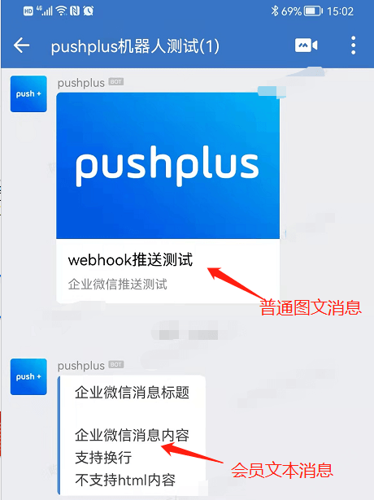
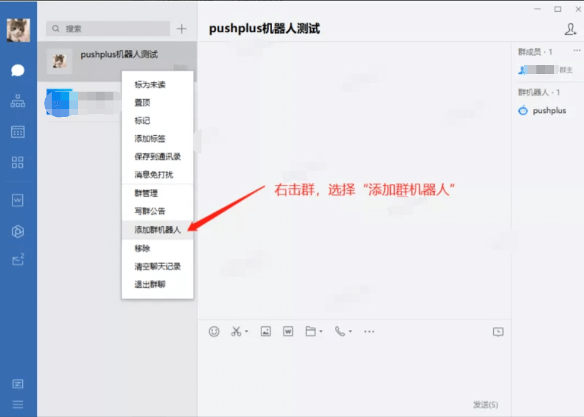
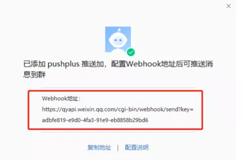
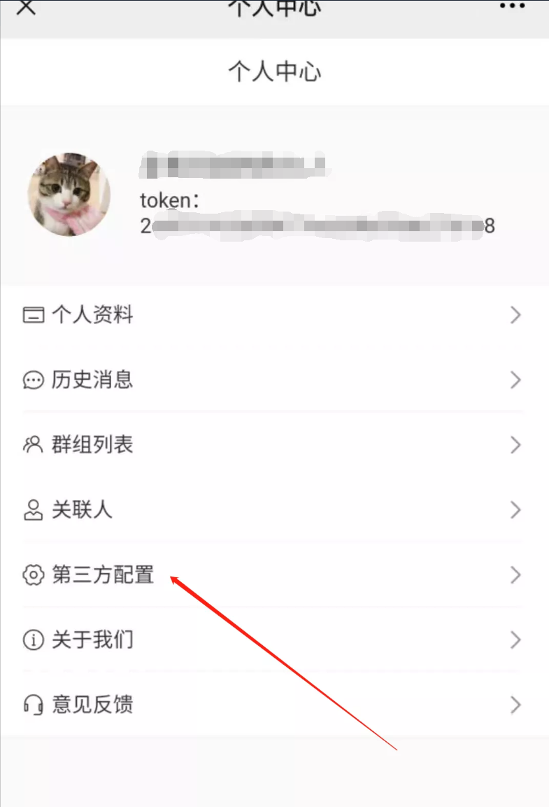
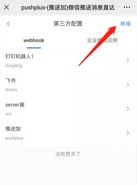
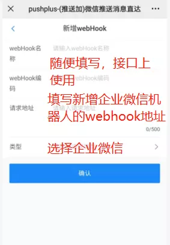
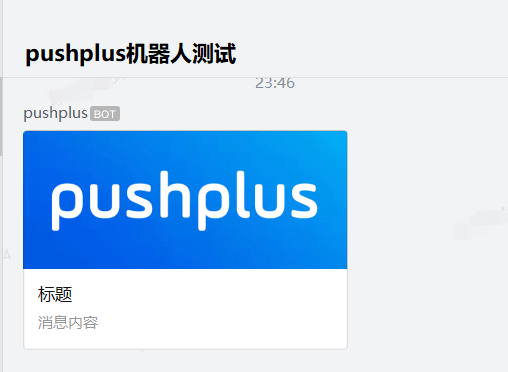
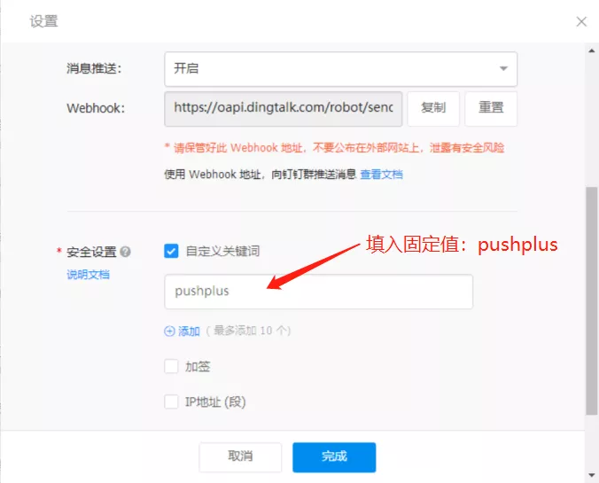

# pushplus推送到企业微信机器人教程

## 引言
　&emsp;&emsp;pushplus目前已经实现了将消息推送到企业微信、钉钉、飞书机器人等渠道。这里以企业微信机器人为例，演示下具体的操作流程。

## 会员特权
#### 直接显示纯文本内容
会员用户使用企业微信机器人在发送模板为txt的情况下，如果消息标题+消息内容文字小于1900个字的话，消息会直接以文字的形式发送。其他情况下会使用图文的方式发送。\
效果如下：



## 使用步骤
#### 一、您需要有一个企业微信
　&emsp;&emsp;目前企业微信是免费注册的，不一定需要有公司也能直接使用。

#### 二、在群中新增一个群机器人
　&emsp;&emsp;右击您需要增加机器人的群，选择“添加机器人”，创建一个机器人。机器人名称填写“pushplus”。完成机器人的创建。



#### 三、复制webhook地址
　&emsp;&emsp;复制保存好创建好机器人的Webhook地址，后续配置中需要使用。


#### 四、在pushplus中配置webhook
1. 打开“pushplus 推送加”的公众号，进入公众号菜单上的“功能”->“个人中心”。
2. 在个人中心里打开“第三方配置”。



3. 在“webhook”标签页中点击右上角的“新增”按钮。新增一个webhook配置。



4. 填写具体的信息
　&emsp;&emsp;其中webhook名称随便填写，仅方便自己区分；
- webhook编码用于消息发送接口中的“webhook”参数；
- 请求地址填写第三步中复制的企业微信机器人webhook地址；
- 类型选择企业微信。



5. 保存完成上述步骤后，相关的配置就完成了。可以在消息发送接口中使用了。

#### 五、接口中使用示例
　&emsp;&emsp;接口上与微信渠道不同的是新增了两个参数。一个channel参数，填写固定值webhook；另一个webhook参数，填写上一步配置中自己定义的webhook编码。
　&emsp;&emsp;具体示例如下：
- 请求地址：http://www.pushplus.plus/send
- 请求方式：POST
- Content-Type: application/json
- 请求body内容：
```
{
    "token":"{token}",
    "title":"标题",
    "content":"消息内容",
    "channel":"webhook",
    "webhook":"自定义的webhook编码"
}
```

#### 六、调用成功后即可在企业微信上收到对应的消息。
　&emsp;&emsp;企业微信上机器人将会用图文消息发送。



　&emsp;&emsp;其他渠道设置方式大同小异，需要注意的是像钉钉机器人需要在安全设置中选择“自定义关键词”，关键词填写“pushplus”。不然会无法接受到消息。”


