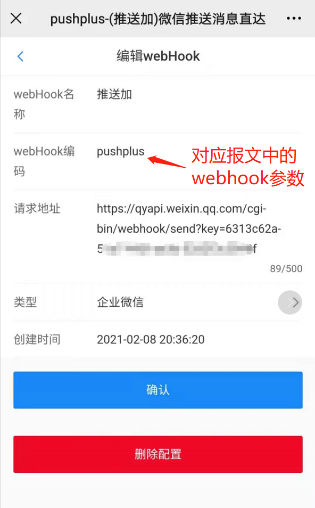

# webhook渠道配置说明

## 引言
　&emsp;&emsp;pushplus支持将消息推送到企业微信、钉钉、飞书机器人等渠道。整体配置上大同小异，主要是不同webhook类型需要填写不同的请求地址，具体可以查看各类型的操作流程。

## webhook渠道配置参数说明
 


| 显示名称 | 接口参数名称 | 说明 |
| -- | -- | --|
| Webhook名称 |  webhookName | 自定义名称，方便用户自己区分不同的配置 |
| Webhook编码 | webhookCode |  发消息接口的webhook参数填写此值 |
| 请求地址 |  webhookUrl | 由第三方系统提供的地址，具体查看第三方系统的文档说明 |
| Webhook类型| webhookType | 支持的第三方系统 |


## 不同Webhook类型配置参考

| Webhook类型 | 请求地址示例 |  配置教程 |
| --| --| --|
| 企业微信机器人 | https://qyapi.weixin.qq.com/cgi-bin/webhook/send?key={自己的值}  | [pushplus推送到企业微信机器人教程](/extend/cpbot.md) |
| 钉钉机器人 | https://oapi.dingtalk.com/robot/send?access_token={自己的值} | pushplus推送到钉钉机器人教程](/extend/dingding.md) |
| 飞书机器人 | https://open.feishu.cn/open-apis/bot/v2/hook/{自己的值} |  [pushplus推送到飞书机器人教程](/extend/feishu.md) | 
| bark | https://api.day.app/{自己的值}| 暂无|
| Gotify | https://{自建服务器地址}/message?token={自己的值} | 暂无|
| 腾讯轻联 | webhook生成的地址 | [通过腾讯轻联实现发送短信](/extend/hiflow.md) |
| 集简云 | https://hook.jijyun.cn/v1/accept/data/webhook_accept_first?apikey={自己的值} | [通过集简云发送企业微信应用消息](/extend/jijyun.md) |
| IFTTT | https://maker.ifttt.com/use/{自己的值} | [调用IFTTT的webhook触发器教程](/extend/ifttt.md) |
| Server酱 | https://sctapi.ftqq.com/{自己的值}.send | 暂无 |
| WxPusher | https://wxpusher.zjiecode.com/api/send/message/?appToken={自己的值} | 暂无 |

- 注意：请求地址示例中需要将“{自己的值}”替换为从第三方系统中获取到的值，且无需“{}”符号！具体地址以第三方系统中提供的为准。


## 发送消息示例
　&emsp;&emsp;发送消息接口主要需要配置两个参数。一个channel参数，固定填写webhook；另一个webhook参数，填写自己定义的webhook编码（webhookCode）。\
　&emsp;&emsp;具体示例如下：
- 请求地址：https://www.pushplus.plus/send
- 请求方式：POST
- Content-Type: application/json
- 请求body内容：
```
{
    "token":"{token}",
    "title":"标题",
    "content":"消息内容",
    "channel":"webhook",
    "webhook":"自己定义的webhook编码（webhookCode）"
}
```