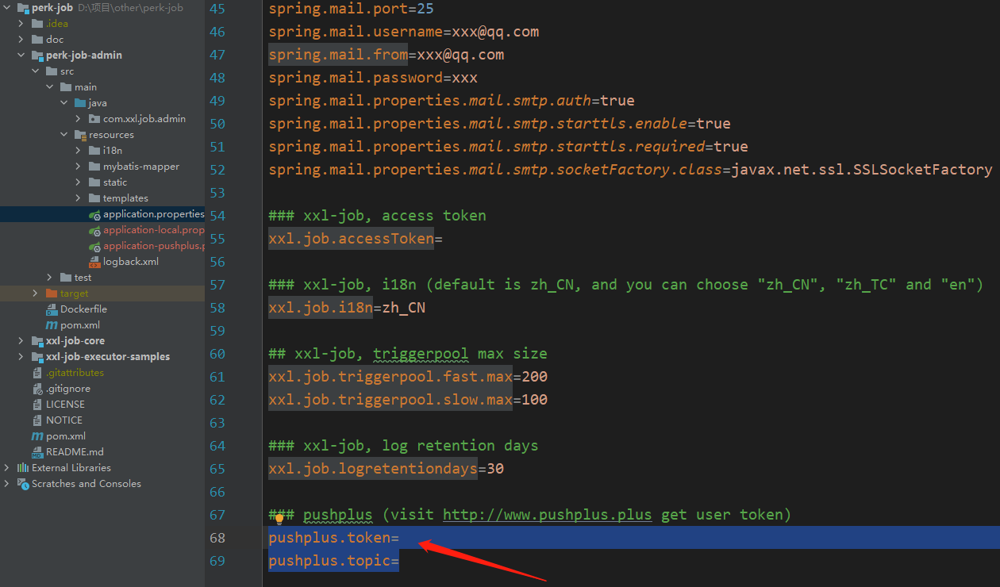
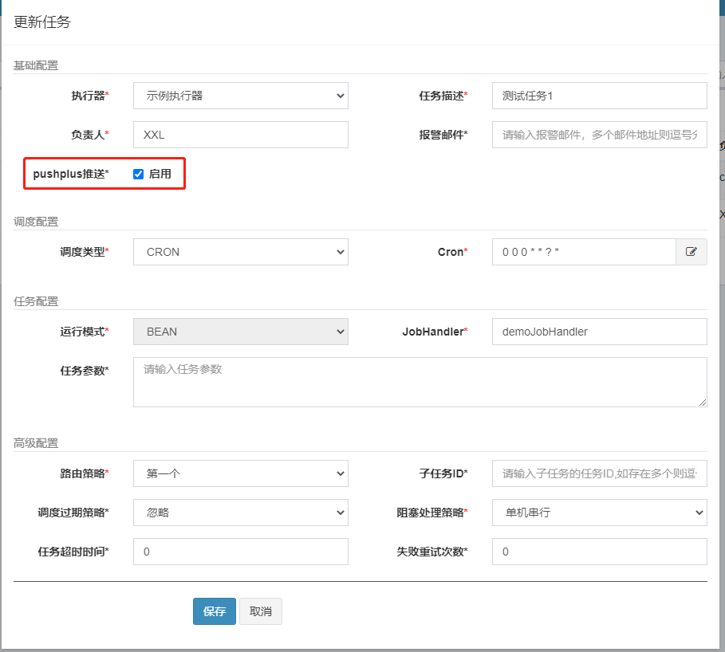
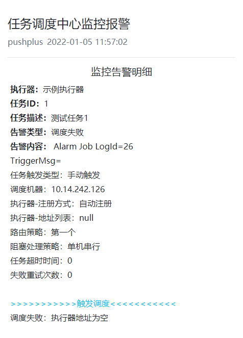

# perk-job(xxl-job集成pushplus告警推送)
在xxl-job基础上增加了pushplus推送告警功能。仅修改调度器管理界面系统，没有修改调度器逻辑，保留xxl-job核心功能，不影响官方的版本迭代升级。

> perk-job项目仓库：[https://github.com/pushplus/perk-job](https://github.com/pushplus/perk-job)

## 修改点
1. 基于xxl-job V2.3.0官方源码修改。
2. `xxl_job_info`表中新增字段`alarm_pushplus`字段。用于存储单个任务是否开启pushplus推送。
3. 新增PushplusJobAlarm.java类，实现pushplus告警逻辑。同时配置邮件和pushplus的情况下，优先推送pushplus告警。
4. 任务详情页面增加“pushplus推送”开关，可以控制单个任务是否启用pushplus推送。
5. application.properties文件增加pushplus.token和pushplus.topic两个参数。具体配置参数值访问: [https://www.pushplus.plus/](https://www.pushplus.plus/) 获取。

## 使用方式
1. 执行新增字段SQL语句。
```
ALTER TABLE `xxl_job_info`
    ADD COLUMN `alarm_pushplus` int NULL DEFAULT 0 COMMENT '是否启用pushplus推送；0否，1是' AFTER `alarm_email`;
```
2. 从pushplus官方（[https://www.pushplus.plus/](https://www.pushplus.plus/) ）获取自己的token，如需要多人接收还需创建群组，获取群组编码。
3. 在application.properties中pushplus.token填入自己的token。如需群发在pushplus.topic填入创建的群组编码。



5. 编译perk-job-admin项目，打成jar包。
6. 运行项目，命令：nohup java -jar perk-job-admin-2.3.0.jar > /dev/null 2>&1&
7. 访问系统，正常创建需要的定时任务。在任务详情页面勾选“pushplus推送”选项。



8. 当job执行时发生异常，微信上即可收到来自“pushplus 推送加”公众号上的告警消息。

