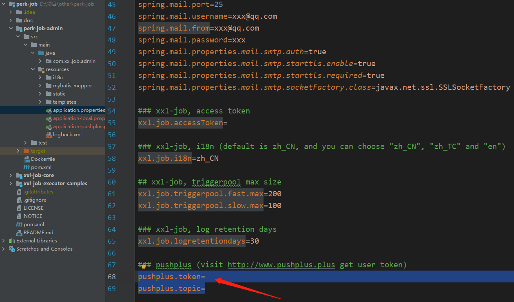
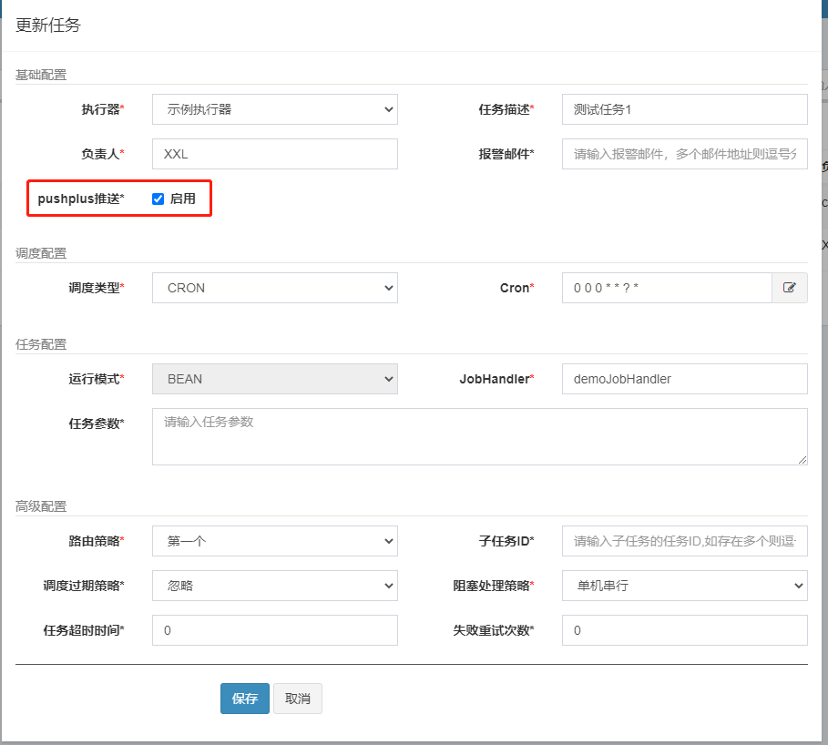
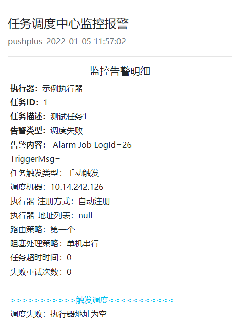

# perk-job(xxl-job集成pushplus告警推送)
在xxl-job基础上增加了pushplus推送告警功能。仅修改调度器管理界面系统，没有修改调度器逻辑，保留xxl-job核心功能，不影响官方的版本迭代升级。

> perk-job项目仓库：[https://github.com/pushplus/perk-job](https://github.com/pushplus/perk-job)

## 修改点
1. 基于xxl-job V3.4.2官方源码修改。
2. `xxl_job_info` 表新增 PushPlus 相关字段，用于按任务控制是否推送，以及发送渠道、渠道配置、预处理编码。
3. 新增 `PushplusJobAlarm`，任务失败时按配置调用 PushPlus 发送告警。
4. 任务新增/编辑页增加「pushplus推送」开关，可选择发送渠道、填写渠道配置和预处理编码。
5. `application.properties` 增加 PushPlus 全局配置：`pushplus.token`、`pushplus.topic`、`pushplus.channel`、`pushplus.option`、`pushplus.pre`。参数说明见 [PushPlus 消息接口文档](https://www.pushplus.plus/doc/guide/api.md)。


## 使用方式
1. 初始化或升级数据库。新库直接执行 `doc/db/tables_xxl_job.sql`；已有库执行 `doc/db/pushplus.sql`：

```sql
ALTER TABLE `xxl_job_info`
    ADD COLUMN `alarm_pushplus` int NULL DEFAULT 0 COMMENT '是否启用pushplus推送；0否，1是' AFTER `alarm_email`;

ALTER TABLE `xxl_job_info`
    ADD COLUMN `alarm_pushplus_channel` varchar(128) NULL DEFAULT NULL COMMENT 'pushplus发送渠道' AFTER `alarm_pushplus`,
    ADD COLUMN `alarm_pushplus_option` varchar(255) NULL DEFAULT NULL COMMENT 'pushplus渠道配置' AFTER `alarm_pushplus_channel`,
    ADD COLUMN `alarm_pushplus_pre` varchar(128) NULL DEFAULT NULL COMMENT 'pushplus预处理编码' AFTER `alarm_pushplus_option`;
```

2. 在 [pushplus 官网](https://www.pushplus.plus/) 获取 token。如需群发，创建群组并获取群组编码；如需 webhook / 企业微信 / 邮箱等渠道，在个人中心配置渠道编码；会员可配置预处理编码。

3. 在 `perk-job-admin/src/main/resources/application.properties` 中填写全局配置：

```properties
### pushplus
pushplus.token=你的token
pushplus.topic=群组编码（可选）
### wechat / app / extension / webhook / clawbot / qq / cp / mail / sms / voice，多个渠道用逗号分隔
pushplus.channel=wechat
### webhook、企业微信应用、邮箱等渠道编码，多个渠道时与 channel 一一对应
pushplus.option=
### 预处理编码，会员可用
pushplus.pre=
```



5. 编译perk-job-admin项目，打成jar包。
6. 运行项目，命令：nohup java -jar perk-job-admin-3.4.2.jar > /dev/null 2>&1&
7. 访问系统，正常创建需要的定时任务。在任务详情页面勾选“pushplus推送”选项。



8. 当job执行时发生异常，微信上即可收到来自“pushplus 推送加”公众号上的告警消息。


