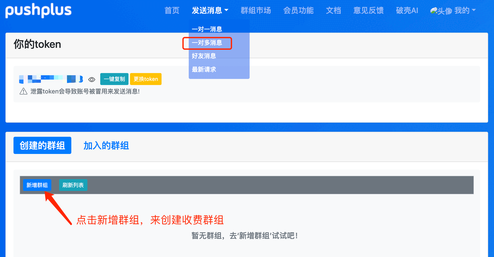
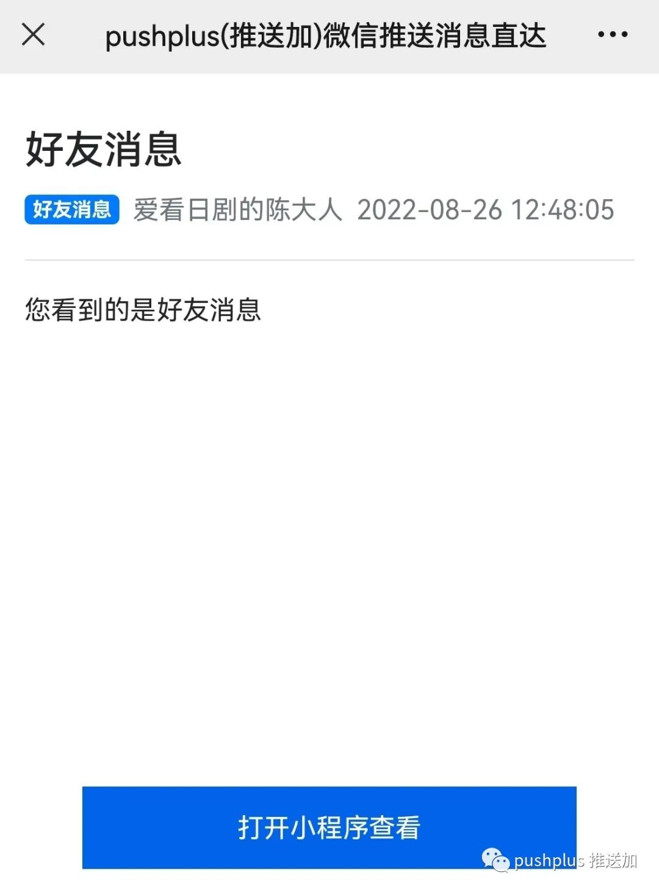

# 好友消息使用说明

## 引言
&emsp;&emsp;好友消息主要解决的是一对多消息不够灵活的问题。原本给他人发消息必须新建群组，如果有给多人分别发不同的消息就需要创建多个群组，操作起来比较麻烦不够灵活自由。而好友消息就可以在发送消息的时候指定具体接收用户，给不同好友定制发送不同的消息内容。



## 使用步骤
&emsp;&emsp;发送好友消息需要先增加好友，让其他用户扫码自己的二维码，即可增加好友。增加好友和删除好友都是双向的。增加好友以后，即可在我的好友列表中查到好友令牌，使用好友令牌调用发送消息接口来发消息。\
&emsp;&emsp;收到的消息上会显示这条消息是“好友消息”，如果好友授权的微信昵称，同时也会展示出发送方的维系昵称。



## 接口调用说明：
请求参数中增加了一个to参数，填写好友令牌。to参数中可填写多个好友令牌，使用逗号隔开。
#### 示例：
- 请求地址：http://www.pushplus.plus/send
- 请求方式：POST
- 请求内容：
```
{
    "token":"{token}",
    "title":"标题",
    "content":"消息内容",
    "to":"5813c18bb0fa462789028312dae30224",
    "template":"html"
}
```

#### 一些限制说明：
1. 目前好友实名用户最多添加1000人，会员用户最多可添加2万人，超过后请删除好友后再增加新的好友。
2. 一次请求to参数中实名用户最多可填写10个好友令牌，会员用户可填写100个好友令牌。超出部分会被截取忽略。
3. 使用企业微信渠道，好友令牌请填写企业微信中的用户账号，在企业微信通讯录中查看。
4. webhook渠道不支持好友消息，接收人是在webhook配置中决定的。
5. 好友消息和一对多消息不能共用，如果在发送消息接口传了topic参数和to参数，会优先使用一对多消息。
