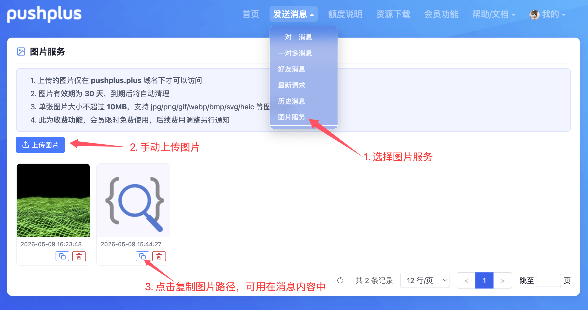

# 图片服务说明

## 引言
&emsp;&emsp;如需在发送的消息中包含图片，可以使用上传图片接口先上传自己的图片，然后将图片url地址通过标签的方式填写在消息内容中。\
原本需要自行寻找图床，现在pushplus已提供图片服务，自带可访问的https图片CDN地址，直接嵌入消息中，不用担心流量限制、图床防盗链、https证书等问题。

## 使用限制
&emsp;&emsp;由于图片体积较大，会耗费较多流量和带宽资源，为防止恶意攻击，有如下相关限制。
1. 图片服务为收费服务，目前会员用户限时免费使用，后续费用调整另行通知。
2. 上传的图片仅在 pushplus.plus 域名下才可以访问。直接打开或嵌入到其他域名下图片将无法访问。
3. 图片有效期为 30 天，到期后将自动删除。
4. 单张图片大小不超过 10MB。

## 界面操作说明

&emsp;&emsp;在浏览器打开 [图片服务页面](https://www.pushplus.plus/image.html)，使用 pushplus 账号登录后即可上传与管理图片。

1. **上传图片**：按页面上的上传入口选择本地图片文件并提交。
2. **查看列表**：上传成功后，可在页面中浏览已上传图片（通常为缩略图 + 相关信息）。
3. **预览与复制链接**：在列表中打开图片预览，可在预览窗口内复制链接。将该 HTTPS 地址填入推送内容的 HTML（例如 ``）即可在消息中展示图片。
4. **删除图片**：在列表中发起删除时，会弹出确认对话框；确认后图片将从服务端删除且不可恢复，请谨慎操作。

## 接口调用

&emsp;&emsp;推荐使用官方 [pushplus SDK](../guide/sdk.md)，而不是自行编写 HTTP 请求代码。SDK 已封装 AccessKey 刷新、上传图片、发送消息等常见场景，可降低开发成本和出错概率。

&emsp;&emsp;程序化上传时：先在 pushplus 侧取七牛上传凭证，再把文件发到七牛；列表与删除仍走 pushplus 接口。完整字段与示例见文末文档链接。

**前置条件**：除「步骤 ② 上传到七牛」外，调用 pushplus 接口时均须在请求头携带 `access-key`。获取方式：[一. 获取AccessKey](../guide/openApi.html#一-获取accesskey)。

### 上传一张图片（三步）
 
| 步骤 | 调用谁 | 要点 |
|:---:|:---|:---|
| ① | pushplus | 拿到 `uploadToken`、`uploadUrl`（凭证有时效，见接口返回） |
| ② | 七牛云 | `Content-Type: multipart/form-data`，表单字段 `token`、`file` |
| ③ | — | 使用响应 JSON 中的 `url` 作为消息里的图片地址 |

### 管理已上传图片（可选）

| 用途 | pushplus 接口 | 请求方式 |
|:---|:---|:---:|
| 分页查询列表 | `/api/open/userImage/list` | POST（JSON body） |
| 按 id 删除 | `/api/open/userImage/delete?id=` | DELETE |

**文档**：路径前缀、参数说明与响应示例见 [开放接口文档 · 十二. 图片管理接口](../guide/openApi.html#十二-图片管理接口)。
