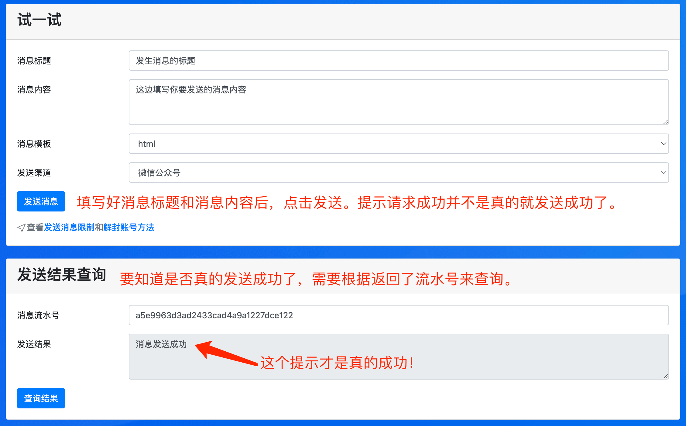

# 发送消息使用说明

## 引言
&emsp;&emsp;pushplus 推送加目前支持三种消息推送方式。分别是“一对一消息”，“一对多消息”，“好友消息”。
- 一对一消息：给自己一个人发送消息。
- 一对多消息：给群组内的所有人发送消息，接收用户需要先加入群组。
- 好友消息：给其他某一个人发送消息，接收用户需要先增加成为好友。

## 发送消息的方式
### 一. 网页上发送消息
　&emsp;&emsp;可以在pushplus官网上点击“发送消息”->“一对一消息”进入功能页面。在“试一试”中填入需要的消息标题和内容，点击“发送消息”按钮来发起一条推送请求。注意，推送请求成功并不代表就会推送消息，又可能因为配置或账号等原因不会真的发送消息。需要根据返回的消息流水号来查询消息的最终发送结果。当然如果您在pushplus公众号中接收到一条刚刚推送的消息内容，也就代表成功了！



### 二. 使用API调用
　&emsp;&emsp;网页上只是测试验证，确保功能上是可用的。实际使用中还是需要通过接口来推送消息。
更多的参考[消息接口文档](../guide/api.md)中的说明来发送接口。注意控制接口请求的频率和次数，避免给用户造成骚扰。具体的请求限制参考[发送消息接口有什么限制吗？](../help/limit.md)。

#### API调用示例
- 请求地址：https://www.pushplus.plus/send/
- 请求方式: POST
- 请求内容：

```
{
    "token":{token},
    "title":"标题",
    "content":"消息内容"
}
```
- 说明：具体使用的时候将请求内容中的{token}替换成自己的用户token或者消息token。

　&emsp;&emsp;如果您是第三方开发者，也请注意下代码逻辑。
1. 发送消息接口是异步的，请勿直接根据同步返回的“请求成功”来认为消息就是发送成功了！而是根据同步返回的流水号来异步的查询最终消息结果。
2. 根据返回码来判断是否继续发送消息，避免账号被封请异常情况的发生。具体可以参考：[接口返回码说明](../guide/code.md)
3. 请控制接口请求的次数和频率。发送消息接口并不是可以无限调用的。

### 三. 使用第三方开发的工具
　&emsp;&emsp;除了自己开发，网上还有一些软件工具或者脚本已经集成了pushplus的发送消息功能，只需要配置自己的用户token或者消息token，无需关心具体的接口等信息，即可快捷的使用。对于这些第三方开发的工具，需要注意请求的频率控制，第三方开发者不一定很好的实现了判断逻辑来防止异常情况下消息频繁发送的情况，从而会出现账号被封，无法接收消息等情况。

　&emsp;&emsp;如果您使用了第三方工具，在使用过程中碰到了问题请与第三方开发者联系。
