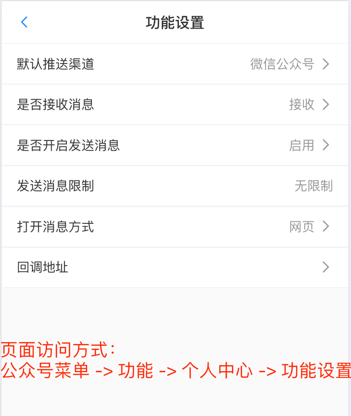

# 接收/发送消息设置

　&emsp;&emsp;在公众号“pushplus 推送加”的菜单“功能”->“个人中心”->"功能设置"中有一些关于收发消息的设置选项。

 
## 一、默认推送渠道
　&emsp;&emsp;用户默认是通过微信公众号来接收消息的。首先在推送消息的时候可以通过channel字段来指定。如果没有指定channel参数的，会按照这边的设置来选择渠道进行推送。

　&emsp;&emsp;渠道参数对于不同推送渠道填写不同的值，用于指定具体使用哪个配置来推送。对于企业微信应用填写“自定义编码”；对于第三方webhook填写“webhook编码”。

## 二、是否接收消息
　&emsp;&emsp;如果不想接收新的推送消息。这边可以设置“关闭”。

## 三、是否开启发送消息
　&emsp;&emsp;关闭后将无法调用发送消息接口。可以用于token泄露后紧急关闭，或者排查消息调用逻辑。

## 四、打开消息方式
　&emsp;&emsp;默认是H5网页的方式打开，可以选择使用小程序的方式来展示消息内容。

## 五、发送消息限制
　&emsp;&emsp;微信渠道因为微信官方的原因每日都有数量限制。pushplus为了保障所有用户的正常使用，在推送微信渠道上做了相关限制，如有恶意用户大批量的请求会自动被系统拦截拉黑。这边可以查看自己的账号是否被系统限制。如发现被限制请及时调整推送的程序功能。

## 六、回调地址
　&emsp;&emsp;提供了三个事件的回调，分别是消息回调、群组新增用户回调、新增好友回调。配置后会在触发事件的时候，把内容回调到配置的地址上。具体可以参考：[消息回调说明](../guide/callback.md)

## 七、消息中显示IP
　&emsp;&emsp;默认启用，会在消息详情中显示推送方的IP地址和归属地，设置关闭后会隐藏自己推送出去消息详情中的IP地址，仅显示归属地。