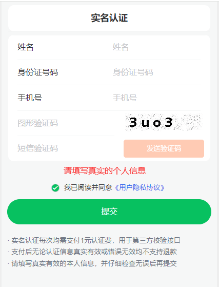
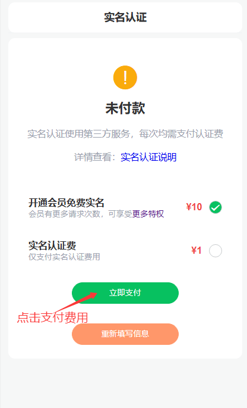
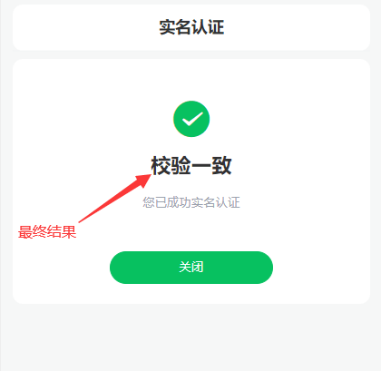

# 实名认证说明
&emsp;&emsp;pushplus将于2024年8月1日实行网站实名制。届时未实名的用户将会无法使用“发送消息”和“积分充值”功能，接口将会返回905的错误码。仅影响发送消息接口和支付功能，不影响接收消息和其他接口功能！请尽快完成实名认证，以免影响消息推送。

[点击进行实名认证](https://www.pushplus.plus/center/real-auth?source=push)

## 原因
 &emsp;&emsp;为了进一步提升网站的安全性和服务质量，我们将逐步实行网站用户的实名制。以下是我们推行实名制的主要原因：

- 保障用户权益：实名制有助于保护您的个人信息和账户安全，防止不法分子冒用您的身份进行非法活动。同时，实名制也能有效减少网络欺诈和虚假信息的传播，营造一个更加安全、可信的网络环境。

- 符合法律法规：根据国家法律法规的要求，互联网网站需要对用户进行实名登记。这不仅是为了遵守法律规定，也是为了维护网络秩序和社会稳定。

- 防止网络诈骗：通过实名制，我们可以有效追踪和管理用户的真实身份，从而大大降低网络诈骗的风险。不法分子在进行诈骗活动时往往会利用虚假身份，实名制能够有效遏制这些行为，保护用户的财产安全。

## 操作流程
在个人中心-> 个人资料中可以查看账号是否已实名。未实名用户可以点击“实名认证”进入到实名认证页面。

[点击进行实名认证](https://www.pushplus.plus/center/real-auth?source=push)

第一步：录入个人姓名，身份证号码，手机号码和短信验证码。请确保信息的真实有效，以免影响最终的结果。

第二步：支付认证服务费。系统对接合法的三方渠道来进行信息认证，每次调用都会产生一定的费用，无论认证结果是否有效，每次认证都将收费。请确保填写的信息是真实有效的，避免多次缴费。\
建议：开通一个月会员可以免费实名认证，仅需支付1个月会员费。如实名认证失败，也仅收取1元实名认证费用，会自动退款9元会员费。

第三步：展示认证结果。支付成功后将会在页面上展示出认证的最终结果。

## 数据安全
&emsp;&emsp;我们深知您的隐私和信息安全至关重要。请放心，我们将严格按照国家法律法规和隐私政策，对您的个人信息进行加密保护，确保信息不被泄露和滥用。

&emsp;&emsp;感谢您的理解和支持！

## 实名认证相关问题说明
### 为什么要实名？
如上“原因”章节中已经阐明。总结三点：国家法律要求；如发送违法消息可溯源；支付功能防诈骗份子恶意利用。\
多说一句：骗子太多，已经有人被骗了，所以是在防止你被骗！！！

### 实名认证还要收费？
因为第三方接口要收费，同时也避免被恶意利用封装成免费接口。选择“开通会员免费实名”选项时，实名认证无需额外付费，只需正常支付一个月会员费。

### 实名认证返回“校验不一致”结果怎么办？
首先请确保填写信息是正确有效的。其次请确保所填写的姓名、身份证号码与手机号注册时实名的信息是同一人的。大部分原因是手机号注册时实名是另外一个人的原因，请电话联系手机运营商确认。

### 实名认证后返回“查无记录”怎么办？
如出现查无记录有下面几点原因：1）手机号新办理的，数据还未同步上网。2）身份证信息有变更，尚未进行联网同步。\
您可以稍等几天时间再来实名，或联系pushplus的管理员处理。切勿短时间内反复提交相同信息。

### 海外用户没有中国居民身份证，如何实名？
身份证字段是支持填写810000、820000、830000开头的港澳台居民居住证的。其他情况请联系开发者微信或加QQ群，进行人工处理。

### 不认证就不能发消息了吗？
第一段就明确了未实名将不能使用“发送消息”和“积分充值”功能。\
所以什么一对一消息、一对多消息、API调用都属于“发送消息”接口，都不能用。且没有写其他功能不能用，所以是可以正常接收消息的。

### 个人信息如何保障安全？
在“数据安全”章节中已阐述。加密存储，无法直接查看。

### 自动退款说明
1. 实名认证后返回“查无记录”，实名认证费会在24小时内自动退还。
2. 选择“开通会员免费实名”选择，实名认证返回“校验不一致”结果时会自动退还9元会员费。

### 实名认证后来申请退款？
有一些聪明的小可爱在支付后通过投诉的方式来申请退款。
- 首先实名认证是自愿原则，并非强制。
- 其次费用说明在每一步骤都有提前说明，价格公开透明，支付需要人工输入密码，并不会自动扣费。
- 第三，实名认证已返回结果，代表已完成实名服务并交付结果。认证结果并不影响服务本身是否完成。

所以申请退款的行为将会驳回，如多次恶意投诉，账户将会被永久拉黑且不退款！！！

### 最后
pushplus所有的服务，无论是免费的还是收费的，都明码标价，公开透明，在文档中都能找到具体的使用说明。旨在营造一个健康友好的网络环境。但总有不法之徒居心叵测，想着钻漏洞，搞破坏。在此提醒各位用户请合理合法的使用pushplus推送服务，切勿从事违法行为，谢谢！