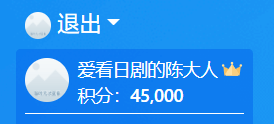
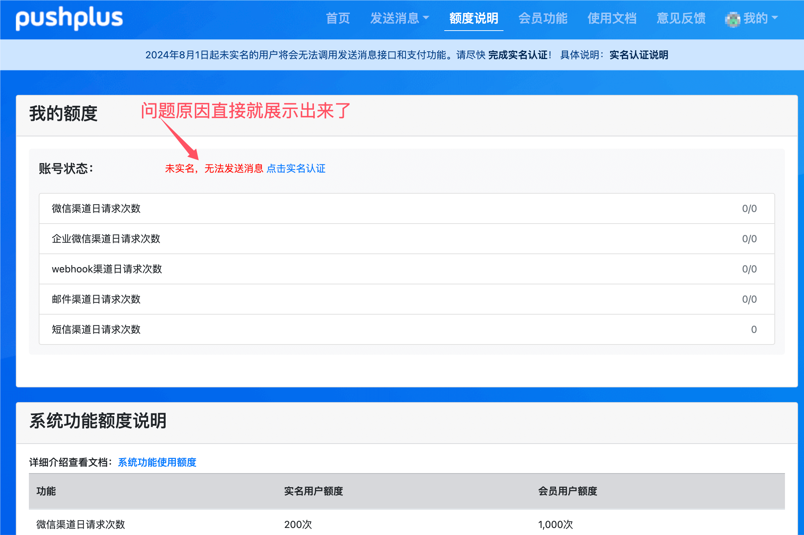
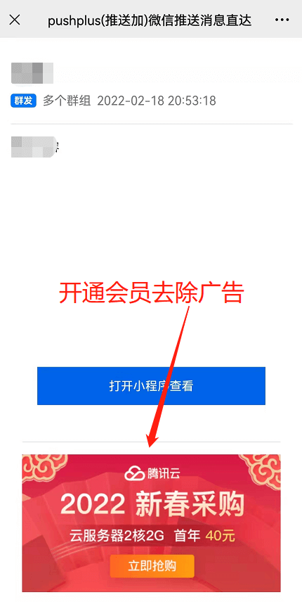
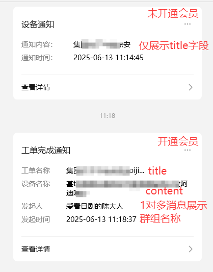
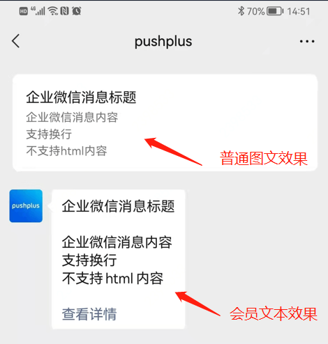
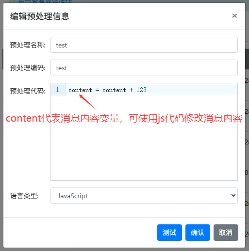
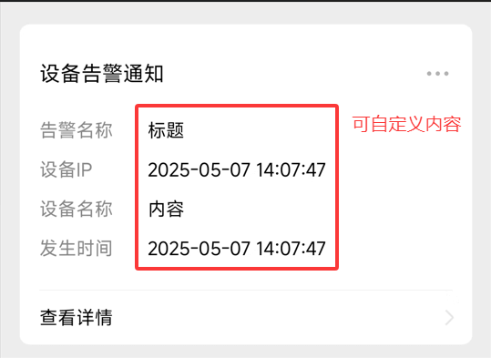

# 会员功能说明

&emsp;&emsp;为满足不同用户的多样化需求，并保障 pushplus 服务的持续运营，我们推出了 pushplus 会员服务。在保留原有功能的基础上，新增多项专属增值权益。

[点击会员开通](https://www.pushplus.plus/vip.html)

## 会员价格

10元/月

## 主要增值权益

### 一、点亮会员专属图标
会员用户名旁将展示专属标识，彰显尊贵身份。

### 二、系统功能额度提升
每日请求次数、消息长度、接口请求频率、可创建群组数、单群组内用户数等额度均大幅提升。例如：实名用户一天仅可请求200次，会员扩大到2000次。
具体查看[额度说明](https://www.pushplus.plus/use.html)

### 三、无广告体验
会员消息详情页无广告，界面更清爽，体验更纯净。

### 四、消息优先推送
会员消息优先于实名用户推送，高峰期能更快收到消息。

### 五、微信渠道消息模板显示更多内容
实名用户仅展示标题，会员用户显示标题、内容、发送人等额外信息。

 
 
### 六、文本消息直接显示
在发送 txt 模板消息时，微信公众号渠道在“激活消息”启用情况下以文本形式展示消息，企业微信应用、钉钉 webhook 机器人、飞书 webhook 机器人直接以文本形式展示消息。

### 七、消息内容可通过预处理代码修改
针对仅能配置回调地址但需修改消息内容的场景，会员可通过预处理代码灵活修改消息内容，无需自建中转服务。具体操作[点击查看](/function/pre.md)

### 八、支持使用自己的公众号推送
可绑定自己的服务号，自定义消息模板和字段内容，更加灵活可控。具体操作[点击查看](/extend/mp.md)

### 九、限时使用pushplus图片服务
限时免费使用pushplus提供的官方图片服务，可发送包含图片的消息。不用担心流量限制、图床防盗链、https证书等问题。\
图片服务为收费功能，后续费用调整另行通知。

### 十、可使用 push表单 高级功能
免费使用push表单的同时，享有高级功能权限。

| 功能| 实名用户 | 会员用户 |
| --- | --- | --- |
|创建表单数量 | 500 | 1万 |
|隐藏提交后广告 |不支持 | 支持 |
|隐藏底部版本信息 |不支持 |支持 |
|提交后跳转链接 |不支持 | 支持 |
