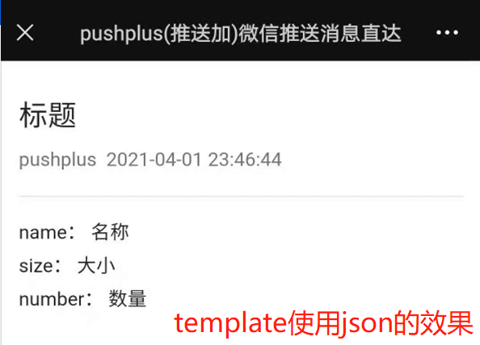
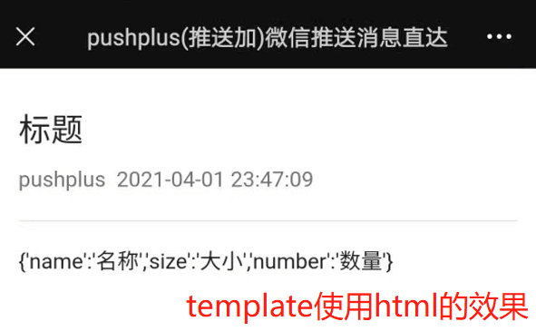
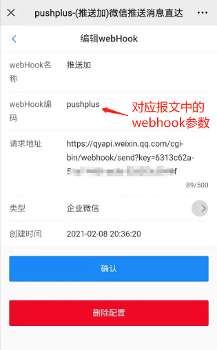
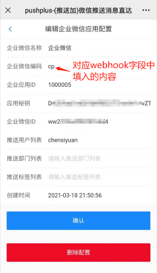
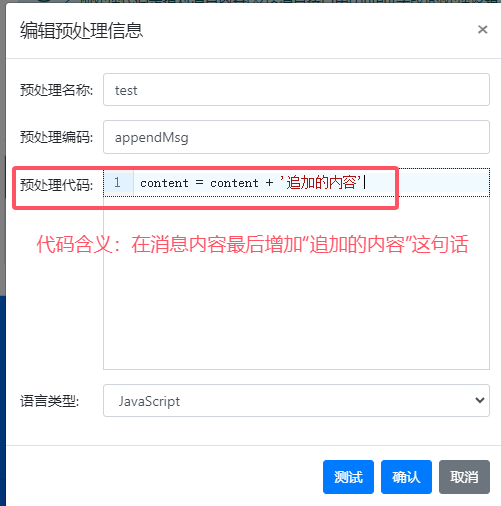

# pushplus 消息接口文档 V1.10.1

> 1.11.0 接口更新日期：2025-05-09\
> 增加浏览器插件渠道
>
> 1.10.1 接口更新日期：2025-05-09\
> 增加GET和POST请求差异说明
>
> 1.9.0 接口更新日期：2024-08-26\
> 增加预处理编码(pre)字段
>
> 1.8.0 接口更新日期：2023-09-25\
> 增加在线调试页面链接
>
> 1.7.1 接口更新日期：2022-12-16\
> 新增好友回调增加自定义二维码参数
>
> 1.7 接口更新日期：2022-09-23\
> 修改消息完成的回调返回内容
>
> 1.6 接口更新日期：2022-09-22\
> 短信渠道正式上线
>
> 1.5 接口更新日期：2022-08-26\
> 增加to参数，来发送好友消息
>
> 1.4 接口更新日期：2021-08-31\
> 新增timestamp时间戳字段，可用于避免重复发送相同消息
>
> 1.3 接口更新日期：2021-06-16\
> 接口由同步改成异步；新增callbackUrl参数，用于异步回调结果
>
> 1.2 接口更新日期：2021-03-30\
> 支持txt格式内容；优化markdown格式内容展示；改进换行问题
>
> 1.1 接口更新日期：2021-03-14\
> 增加webhook推送方式；支持markdown格式内容
>
> 1.0 接口更新日期：2020-06-01\
> 支持多种请求方式，基于不同模板展示不同内容

[[toc]]

## 在线测试页面
可以访问[https://pushplus.apifox.cn/](https://pushplus.apifox.cn/)，在线的测试接口。也可以直接使用页面上生成的代码示例，支持多种语言。

## 一、发送消息接口

- 请求地址：http://www.pushplus.plus/send
- 请求方式：GET,POST,PUT,DELTE
- 请求参数，均支持url参数和body参数：
- Content-Type: application/json


参数名称 | 是否必填 | 默认值 | 说明
---|--- |--- | ---
token | 是 | 无 | 用户token或消息token，可直接加到请求地址后，如：http://www.pushplus.plus/send/*{token}*
title |  否 | 无 | 消息标题
content | 是 | 无 | 具体消息内容，根据不同template支持不同格式
topic |  否 | 无 | 群组编码，不填仅发送给自己；channel为webhook时无效
template |  否 | html | 发送模板
channel |  否 | wechat | 发送渠道
webhook | 否 | 无 | webhook编码
callbackUrl | 否 | 无 | 发送结果回调地址
timestamp | 否 | 无 | 毫秒时间戳。格式如：1632993318000。服务器时间戳大于此时间戳，则消息不会发送
to | 否 | 无 | 好友令牌，微信公众号渠道填写好友令牌，企业微信渠道填写企业微信用户id。多人用逗号隔开，实名用户最多10人，会员100人。
pre | 否 | 无 | 预处理编码。仅供会员使用。可提前自定义代码来修改消息内容。具体用法参考：[预处理信息配置](../function/pre/)

- 发送渠道（channel）枚举

发送渠道 | 是否免费 | 描述
---| --- |--|
wechat | 免费 | 微信公众号
webhook | 免费 | 第三方webhook渠道；企业微信、钉钉、飞书、bark、Gotify、腾讯轻联、集简云、server酱、IFTTT、WxPusher；[webhook机器人推送](../extend/webhook/)
cp | 免费 | 企业微信应用；具体参考[企业微信应用推送](../extend/cp/)
mail | 免费 | 邮箱；具体参考[邮件渠道使用说明](../extend/mail/)
sms | 收费 | 短信；成功发送1条短信需要10积分（0.1元）
extension | 免费 | 浏览器插件；具体参考[浏览器插件使用教程](../extend/extension/)

- 模板（template）枚举。默认使用html模板

模板名称 | 描述
--| --|
html | 默认模板，支持html文本
txt | 纯文本展示，不转义html
json | 内容基于json格式展示
markdown | 内容基于markdown格式展示
cloudMonitor | 阿里云监控报警定制模板
jenkins | jenkins插件定制模板
route | 路由器插件定制模板
pay | 支付成功通知模板

- webhook参数说明。
请到微信公众号菜单中预先进行webhook配置。当前字段需填写配置中的webHook编码。


- 响应内容\
　&emsp;&emsp;原本接口采用同步模式，直接返回发送结果。现在已调整为异步返回结果，同步响应状态只代表收到请求，将会异步处理消息。\
请求成功返回code为200，同时data会返回消息流水号，如请求带有回调地址参数，发送结果会主动回调一次。同时也可以根据消息流水号来查询发送结果。\
请求的时候也会同步验证消息是否合法，可以根据判断code的值来确定请求成功还是失败。

```
{
    "code": 200,
    "msg": "请求成功",
    "data": "3cbc5eab19fe512e80677540fbde332a"
}
```

- 回调内容\
如请求时带有callbackUrl参数，异步发送消息完成后将会发送一个post请求到回调地址上。\
可以公众号菜单中个人中心->功能设置->回调地址中设置回调地址，会回调到设置的地址上。除了消息完成回调，在群组中新增用户和新增好友时也会发送回调到这个地址上。\
消息完成回调post请求的body内容如下：
```
{
	"event": "message_complate",  //回调事件名称;message_complate - 消息完成，add_topic_user - 群组新增用户，add_friend - 新增好友
	"messageInfo": {
		"message": "",  //推送错误内容（如有）
		"shortCode": "88*********50fe",  //消息流水号
		"sendStatus": 2  //发送状态；0-未发送，1-发送中，2-发送成功，3-发送失败
	}
}
```

群组新增用户回调的body内容如下：
```
{
	"event": "add_topic_user",  //回调事件名称;message_complate - 消息完成，add_topic_user - 群组新增用户，add_friend - 新增好友
	"topicUserInfo": {
		"id": 25,     //新增用户编号
		"openId": "oEdHX******aWDg", //新增用户OpenId
		"topicId": 2,   //群组编号
		"userSex": 1,   //性别
		"isFollow": 1,  //是否关注微信公众号
		"nickName": "陈大人",  //昵称
		"havePhone": 1,   //是否绑定手机
		"topicCode": "123",  //群组编码
		"topicName": "123",  //群组名称
		"headImgUrl": "https://thirdwx.qlogo.cn/mmopen/vi_32/DYAIO******Luew/132",  //头像
		"emailStatus": 2  //是否绑定邮箱
	}
}
```

新增好友回调的body内容如下：
```
{
	"event": "add_friend",  //回调事件名称;message_complate - 消息完成，add_topic_user - 群组新增用户，add_friend - 新增好友
    "qrCode": "自定义参数",  //自定义二维码参数
	"friendInfo": {
		"token": "5709******ddf",  //好友令牌
		"friendId": 5,      //好友Id
		"isFollow": 1,       //是否关注微信公众号
		"nickName": "",      //好友昵称
		"havePhone": 0,      //是否绑定手机
		"createTime": "2022-09-23 17:02:21", //创建时间
		"emailStatus": 0     //是否绑定邮箱
	}
}
```

## 二、示例

　&emsp;&emsp;接口设计考虑尽可能多的支持各种请求方式。以下举例几种常用的请求方式仅供参考，接口不仅局限于以下几种请求。

#### 示例一，最简单的例子
- 请求地址：http://www.pushplus.plus/send?token={token}&content=pushplus消息内容
- 请求方式: GET
- 说明：具体使用的时候将请求地址上的{token}替换成自己的用户token或消息token。content中如包含中文需要UrlEncode编码处理下。\
GET请求受限于URL长度，content参数内容不宜太长。大段内容请使用post请求！

#### 示例二，POST方式推送消息
- 请求地址：http://www.pushplus.plus/send/
- 请求方式: POST
- 请求内容：

```
{
    "token":"{token}",
    "title":"标题",
    "content":"消息内容",
    "topic":"test"
}
```
- 说明：具体使用的时候将请求内容中的{token}替换成自己的token

#### 示例三，一对多消息的例子
- 请求地址：http://www.pushplus.plus/send/
- 请求方式: POST
- 请求内容：

```
{
    "token":"{token}",
    "title":"标题",
    "content":"消息内容",
    "topic":"code",
    "template":"html"
}
```
- 说明：消息将会发送给加入群组编码为code的成员

#### 示例四，json格式的例子
- 请求地址：http://www.pushplus.plus/send
- 请求方式：POST
- 请求内容：

```
{
    "token":"{token}",
    "title":"标题",
    "content":"{'name':'名称','size':'大小','number':'数量'}",
    "template":"json"
}
```
- 说明：当template参数为json并且放在body中的时候，pushplus会解析content中的json格式内容，以更加友好的方式展示出来。如template参数放在url地址上，会将整个body内容视为content进行解析，具体见下面的例子。
- json模板和html模板效果对比\


<br/>


#### 示例五，webhook的例子
- 请求地址：http://www.pushplus.plus/send/{token}?template=json
- 请求方式：POST
- 请求内容：

```
{
    "userName":"pushplus",
    "updateTime":"2020-04-29 14:59:35",
    "projectId":82
}
```
- 说明：这个例子适用于外部第三方webhook接口，仅能填写url地址，无法修改body内容。示例中整个body内容被当成content处理。

#### 示例六，markdown的例子
- 请求地址：http://www.pushplus.plus/send
- 请求方式：POST
- 请求内容：

```
{
    "token":"{token}",
    "title":"标题",
    "content":"# 大标题 \n ##### 小标题 \n  1. 第一项 \n 2. 第二项 \n 3. 第三项",
    "template":"markdown"
}
```
- 说明：markdown语法参考[https://www.appinn.com/markdown/](https://www.appinn.com/markdown/)。支持html格式，换行使用\n来表示。

#### 示例七，企业微信机器人的例子
- 请求地址：http://www.pushplus.plus/send
- 请求方式：POST
- 请求内容：

```
{
    "token":"{token}",
    "title":"标题",
    "content":"消息内容",
    "channel":"webhook",
    "webhook":"pushplus"
}
```
- 说明：需要先配置对应的第三方webhook，如本例中的编码pushplus即为预先配置好的企业微信机器人。同理也可以配置钉钉机器人、飞书机器人等。<br/>


#### 示例八，企业微信应用的例子
- 请求地址：http://www.pushplus.plus/send
- 请求方式：POST
- 请求内容：

```
{
    "token":"{token}",
    "title":"标题",
    "content":"消息内容",
    "channel":"cp",
    "webhook":"cp"
}
```
- 说明：需要先配置对应的企业微信应用，在webhook字段中填入配置好的企业微信编码，如本例子中的cp。<br/>


#### 示例九，增加时间戳的例子
- 请求地址：http://www.pushplus.plus/send
- 请求方式：POST
- 请求内容：

```
{
    "token":"{token}",
    "title":"标题",
    "content":"消息内容",
    "timestamp": 1632993318000
}
```
- 说明：时间戳使用的是毫秒。如果时间戳小于当前时间，则消息不会发送。用于时效性较强的消息，避免无用的消息重复发送。<br/>

#### 示例十，好友消息例子
- 请求地址：http://www.pushplus.plus/send
- 请求方式：POST
- 请求内容：

```
{
    "token":"{token}",
    "title":"标题",
    "content":"消息内容",
    "to":"5813c18bb0fa462789028312dae30224",
    "template":"html"
}
```
- 说明：好友消息和群组消息不能同时使用，群组消息优先级大于好友消息，请勿同时填写to和topic参数。to参数支持微信公众号渠道，邮件渠道和企业微信渠道，企业微信渠道填写企业微信用户id。<br/>

#### 示例十一，使用邮件渠道的例子
- 请求地址：http://www.pushplus.plus/send
- 请求方式：POST
- 请求内容：

```
{
    "token":"{token}",
    "title":"邮件标题",
    "content":"邮件正文内容",
    "channel":"mail",
    "webhook":"163",
    "template":"html"
}
```
- 说明：使用邮件渠道webhook参数为可选参数，不填默认使用官网邮件来发送，可在渠道配置中配置自定义的邮件发送渠道，填写邮件编码。<br/>

#### 示例十一，使用短信渠道的例子
- 请求地址：http://www.pushplus.plus/send
- 请求方式：POST
- 请求内容：

```
{
    "token":"{token}",
    "title":"短信",
    "content":"消息内容正文",
    "channel":"sms"
}
```
- 说明：短信渠道是需要收费使用，1条短信需要10积分（0.1元）。需要短信发送，接收方需要先绑定手机号。短信本身有字数限制，故无法直接展示内容，只展示标题。<br/>

#### 示例十二，预处理信息修改消息内容的例子
- 请求地址：http://www.pushplus.plus/send
- 请求方式：POST
- 请求内容：

```
{
    "token":"{token}",
    "title":"这是标题",
    "content":"消息内容正文",
    "pre": "appendMsg"
}
```
- 说明：定义的预处理编码(appendMsg)是让消息内容后增加“追加的内容”这几个字。<br/>
