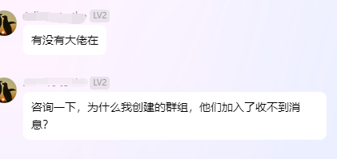
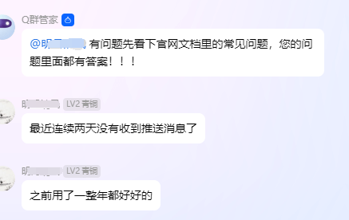
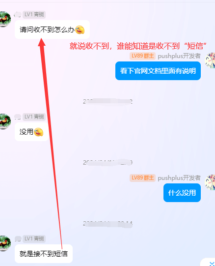
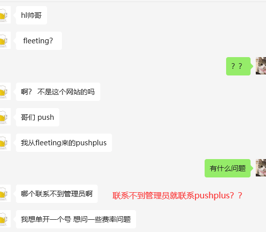
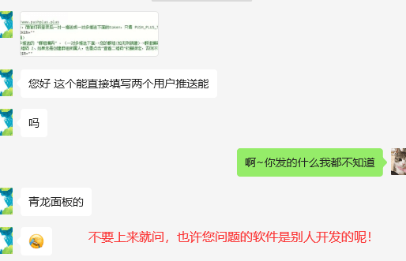
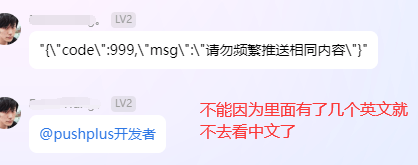
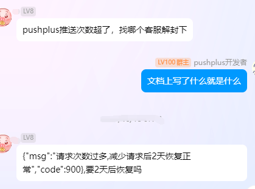

# 常见问题

您在使用中碰到的绝大部分问题都可以在这里找到答案。请先查阅对应的文档，不要无脑的加作者微信咨询遇到的问题。

## 常见问题列表，可解决90%的问题

- [Get请求导致的问题](/help/get.md)
- [实名认证相关问题](/help/verify.md)
- [用户token和消息token有什么区别](/help/token.md)
- [发送消息接口限制](/help/limit.md)
- [微信消息模板是否可以自定义](/help/template.md)
- [收不到消息如何排查](/help/message.md)
- [才收到几条消息却被限制发送了](/help/count.md)
- [IP被禁止访问原因](/help/ip.md)
- [如何解封账号](/help/lockdown.md)
- [一对多消息为什么只有我自己收到](/help/topic.md)
- [提示无用户接收消息](/help/nouser.md)
- [如何在公众号中显示推送内容](/help/showmessage.md)
- [如何一直使用激活消息的模板](/help/activation.md)
- [是否支持发送图片](/help/image.md)
- [消息内容中如何换行](/help/line.md)
- [用户信息状态不合法](/help/status.md)
- [接口是否支持https](/help/https.md)
- [json模板如何正确展示](/help/json.md)
- [pushplus官网](/help/homepage.md)

## 作者碰到的问题，请饶过开发者吧
#### 1. 文档里面已描述的解决方案，但是就是不看，还是加群或加微信咨询。

#### 2. 只描述问题现象，不提供任何个人信息。因为不知道用户是谁，发送的消息报文是什么，无法进行排查。

#### 3. 不讲问题的前因后果。无法知道具体的使用场景和使用方式，忽略重要的前置条件，这是在故意给排查问题的人埋坑。

#### 4. 使用第三方开发者的工具，因为找不到第三方联系，想从pushplus这边来解决碰到的问题。特别是用的那个第三方工具都不说的，上来就只描述XXX不能用了。简直一脸懵！

#### 5. 看不懂中文。把已经返回的报错原因发给作者，再让作者说明解释的。

