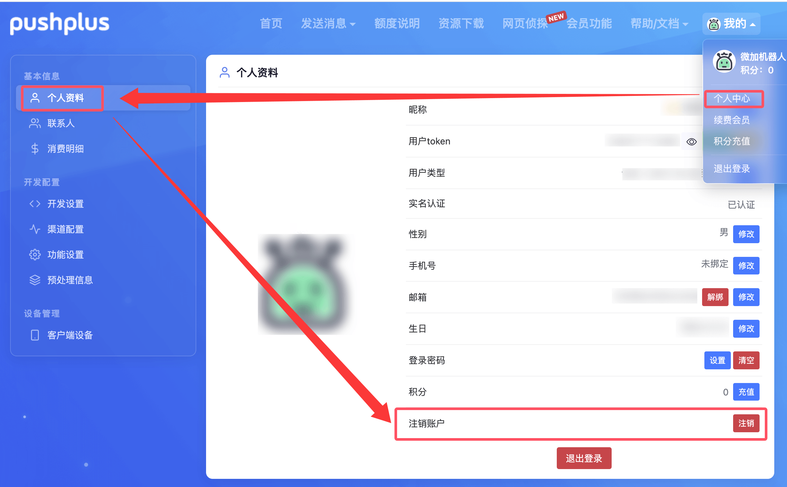
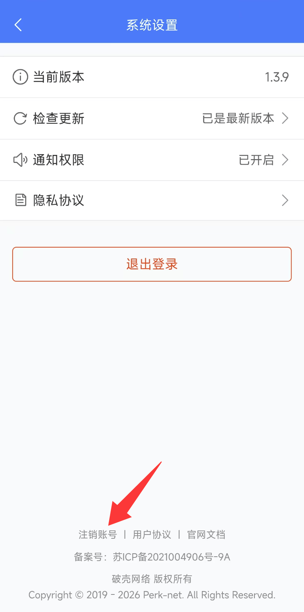

# 如何注销账户？

##  pushplus官网
访问pushplus官网，登录后在个人中心->个人资料->注销账户，进行注销操作。

## pushplus App
手机下载pushplus App，登录后在个人中心->系统设置->注销账号，进行注销操作。

## 注意
1. 账号注销后，无法重新注册和登录
2. 会删除账号下产生的所有数据，且无法找回
3. 发送消息的 token 将全部无效
4. 未消费的积分自动作废，不会退回
