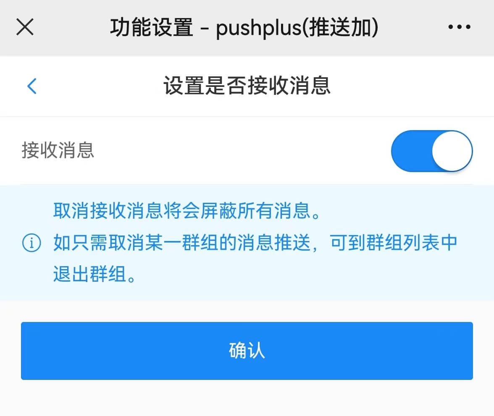

# 提示无用户接收消息
 
&emsp;&emsp;发送消息的时候提示“无用户接收消息”这个错误，主要原因是不存在消息的接收者。可以按如下几点进行排查：

1. 如果使用微信公众号渠道，确认接收用户是否关注了“pushplus 推送加”公众号。
2. 是否屏蔽了“pushplus 推送加”微信公众号的通知。可在“pushplus 推送加”公众号—>设置->通知消息管理 中查看是否均为接收状态。
3. 一对多消息，请检查群组中是否存在用户。自己创建的群组也需要扫码加入群组。
4. 接收消息用户是否禁用了消息接收。在公众号底部菜单->功能->消息开关->启用接收消息。

