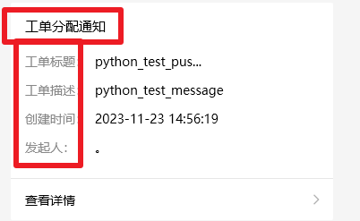
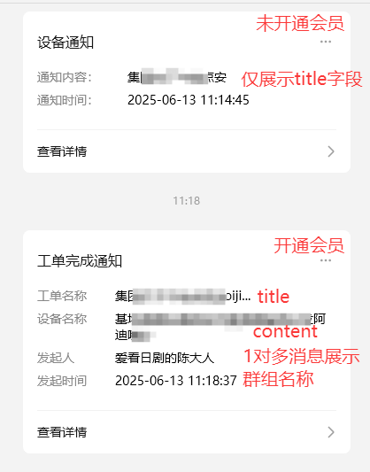

# 微信消息模板是否可以自定义？

 

不可以。微信消息的推送是使用公众号的模板消息来实现的，使用的模板均需要微信官方审核，且不能随便用于无关用途从而造成对用户的骚扰。所以无法自定义模板消息的字段。

微信渠道消息展示可以通过以下方式来处理：
1. 在“pushplus 推送加”公众号中发送“激活消息”，从而使用“客服消息”的方式来接收推送的消息。仅限发送后的5条消息。
2. 绑定自己的服务号，从而可以自定义推送的模板。服务号需要企业或个体工商户认证，每年缴纳300元认证费给微信。
3. 开通会员。会员使用的模板相比普通用户展示了更多的消息内容。

 