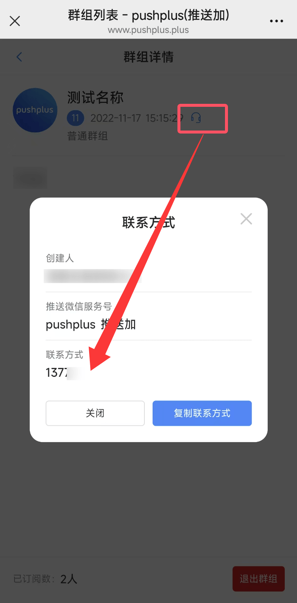

# 联系我们

## 重要提示

- 1. 有问题直接查看“[常见问题](/help/README.md)”，里面能解决90%的问题。
- 2. 收不到消息，账号被封等直接查看“[常见问题](/help/README.md)”里面有解决方案。
- 3. 如您是使用了网上第三方开发的脚本、工具或程序，有问题不要因为找不到那些脚本、工具或程序的开发者就来找pushplus！
- 4. 不是pushplus作者开发的程序不要来找加微信好友问问题。
- 5. puhplus只提供一个消息发送的渠道，类似短信、邮件，具体发什么内容，谁发的，什么时候发跟pushplus毫无关系。
- 6. 还有来问具体如何使用的，我知道您是来问您找的第三方脚本、工具或程序具体如何使用的。但是还是再强调下，您去找第三方开发者，不要因为对方没有留下联系方式就来找pushplus，没用！！！
- 7. 不提供一对一的指导服务，请自行查看文档和常见问题。也不要把系统返回告知的结果、答案发给作者再来问一遍是不是这样。

## pushplus官方渠道
**唯一官网：** [www.pushplus.plus](https://www.pushplus.plus) 

**唯一微信服务号：** \
 &nbsp;&nbsp;&nbsp; pushplus 推送加 \

**官方QQ交流群：**\
一群：28619686  \
二群：161672256  

**官方微信交流群：** \

## 联系消息内容提供方
　&emsp;&emsp;对于大部分问题，还是需要您自行解决，可以通过您关注的渠道，联系到消息内容提供者。您也可以pushplus微信服务号菜单中的【联系人->加入的群组->群组详情】中查看提供方的联系方式。\
　&emsp;&emsp;群组任何人均可自行创建，如果群组创建人没有留联系方式的，pushplus作者也不知道联系方式！

 

## 联系作者
以下情况可以联系pushplus作者：

- 1. 非大陆地区用户需要实名认证的。
- 2. 已购买积分需要开发票的。
- 3. 商务合作的。
- 4. 有功能需要定制开发的。
- 5. 使用pushplus接口中碰到程序报错等异常的。
- 6. 反馈bug的。
- 7. 提交建议或者意见的。

 
 
请添加企业微信，主动描述事由并提供“用户token”。

　&emsp;&emsp;特别说明：如只是碰到没收到消息，账号被封，请求限制等使用问题，请自行查看文档中的[常见问题](/help/README.md)，里面已经详细的描述了如何解决！加作者微信也没用，不会直接告诉你答案和原因的，还是让你看这些文档！！！

## 特别声明
　&emsp;&emsp;pushplus(推送加)是一个开放的平台，使用最简单的方式尽最大可能性的提供各种推送服务功能。为了保障推送的可用性，请勿推送违法、不良信息，如有发现将进行封号处理。感谢您的支持与陪伴！
